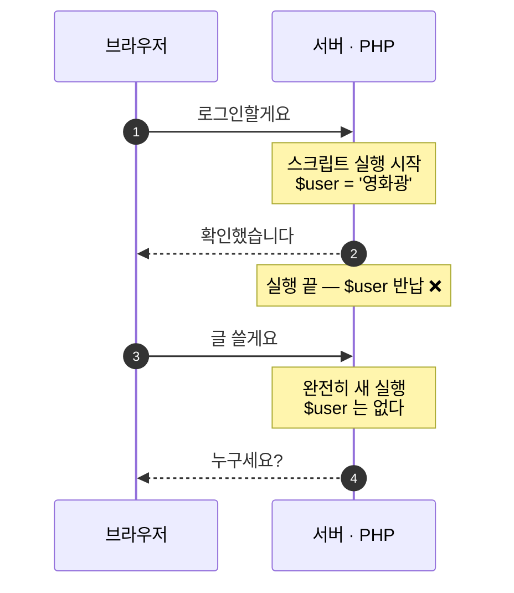
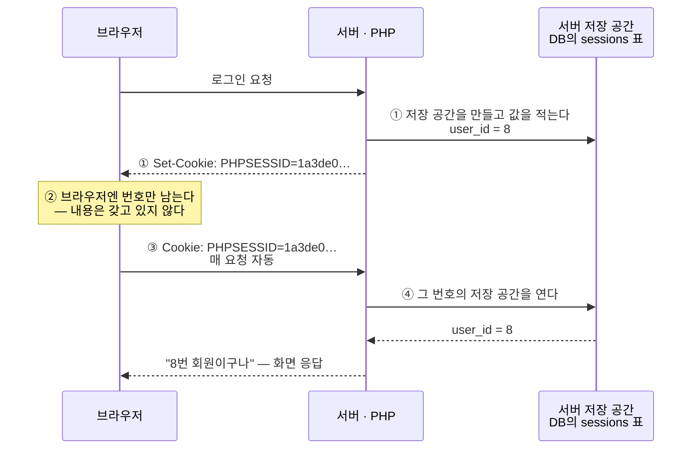

# 🍪 발표 자료 — 쿠키와 세션 (week16 이론)

> **슬라이드 제작용 원고.** 슬라이드는 직접 만들고, 이 문서는 '무엇을 담을지'를 정리한 것.
> 각 장은 **[슬라이드에 넣을 것]** 과 **[말로 풀 것]** 으로 나눠 뒀다.
> 슬라이드에 글을 다 적으면 읽는 발표가 된다 — **슬라이드는 뼈대, 살은 입으로.**

**전체 흐름 (10장 · 이론 7 + 프로젝트 3)**

```
[정의]   1. 쿠키와 세션 — 무엇인가            ← 표지 다음 바로 주제
[문제]   2. 왜 필요한가 — 서버는 원래 기억하지 못한다
         3. 그럼 주소로 하면 안 되나 — 우리가 해봤다
[도구]   4. 쿠키 — 어떻게 동작하나
         5. 쿠키 — 속성과 한계 ("사용자가 고칠 수 있다")
         6. 세션 — 어떻게 동작하나  → 끝에 ⚠️세션 고정 + ★판단 기준
[위험]   7. 세션이 없으면 생기는 문제 — 로그인 유지 · CSRF
[적용]   8. 우리 프로젝트는 무엇을 옮겼나
         9. 자동 로그인 — 쿠키와 DB를 함께 쓰는 실전 설계
        10. 정리 — 한 줄 기준  ※ 우선 보류
```

> **두괄식이다.** 표지 다음에 **주제부터 못 박고**(1장), *왜 필요한지*를 뒤에서 설명한다(2·3장).
> 주제가 '쿠키와 세션'인데 무상태 얘기부터 꺼내면 **본론이 언제 오나** 싶어진다.
>
> 그래서 2·3장의 역할이 바뀌었다 — **'문제 제기'가 아니라 '1장의 근거'** 다.
> "왜 저런 게 필요하냐면 → 서버는 원래 기억을 못 하고(2장) → 주소로 해봤더니 안 되더라(3장)".
>
> ⚠️ **'세션 vs 쿠키' 대조표 장은 따로 두지 않는다.** 대조는 1장(정의)에서 이미 끝났고,
> 프로젝트 적용은 8장 표가 더 자세하다. 남는 건 **판단 기준 한 줄**뿐이라
> **6장 끝**에 붙였다 — 도구 설명이 끝나는 자리가 기준을 말할 자리다.


---

# 1. 쿠키와 세션 — 무엇인가

### [슬라이드에 넣을 것]

> 📋 **아래가 슬라이드에 그대로 옮겨 적을 내용이다.** (스크린샷 없이 글만으로 채운다)

**제목**: 쿠키와 세션

- **쿠키** = 서버가 만들어 **브라우저에 저장하는 「이름 = 값」 형태의 작은 데이터**
  - 있는 곳: **사용자 PC** (브라우저가 사이트별로 보관)
  - 그 사이트에 요청할 때마다 브라우저가 **자동으로 함께 보낸다**
  - 예) `theme = dark`
- **세션** = 서버가 **방문자마다 따로 두는 데이터 저장 공간**
  - 있는 곳: **서버** — 브라우저는 볼 수도 고칠 수도 없다
  - 서버는 저장 공간마다 **고유 번호**를 붙여 구분한다 → 이 번호를 **세션 ID**라고 부른다
  - 브라우저에는 **그 번호만** 준다 (PHP에서는 `PHPSESSID` 라는 이름의 쿠키)
  - 예) 브라우저 `PHPSESSID = 1a3de0…` → 서버 저장 공간 `{ user_id: 8 }`
- **★ 차이 — 값이 어디에 있나**
  - **쿠키**: 값이 **사용자 PC**에 있다 → 사용자가 **고칠 수 있다**
  - **세션**: 값이 **서버**에 있다 → 사용자가 **못 고친다**
- **★★ 둘의 상호작용 — 세션 ID를 나르는 것이 쿠키다**
  - 서버가 응답에 **`Set-Cookie: PHPSESSID=1a3de0…`** 를 실어 보내면
  - 브라우저가 그걸 **자기 쿠키 저장소에 기록**한다
  - 이후 요청마다 브라우저가 **`Cookie: PHPSESSID=1a3de0…`** 를 자동으로 붙인다

```
🧳 쿠키   짐을 직접 들고 다닌다        → 열어볼 수 있다 · 바꿀 수 있다
🎫 세션   짐은 보관소에, 손엔 번호표    → 못 열어본다 · 못 바꾼다
```

> **출처 (슬라이드 맨 아래 작게)**
> ko.wikipedia.org/wiki/HTTP_쿠키 · ko.wikipedia.org/wiki/세션_(컴퓨터_과학)

> ✅ **이 장의 한 문장**: 차이는 **값이 어디 있느냐**뿐이다.
> 그리고 둘은 경쟁 상대가 아니다 — **세션도 쿠키를 쓴다.**

> 💡 **자리가 남으면** 넣을 것 — 없어도 되는 순서로:
> ① 🧳🎫 두 줄 → ② `theme=dark` / `PHPSESSID` 예시 → ③ "있는 곳" 줄
> **절대 빼지 말 것**: 굵은 정의 두 줄 + ★ 차이 + ★★ 상호작용

### [말로 풀 것]

> "오늘 주제는 쿠키와 세션입니다. **두 문장으로 시작하겠습니다.**
> **쿠키는 브라우저가 기억하고, 세션은 서버가 기억한다.**
> 오늘 나올 얘기는 **전부 이 한 줄에서 파생되는 결과**입니다."

**➡️ 다음 장으로 넘기는 한 줄** (두괄식이라 여기서 '왜'를 예고한다):
> "그런데 **애초에 왜 이런 게 필요할까요?** 로그인을 한 번 했으면 서버가 기억하면 될 텐데요.
> **서버는 원래 기억을 못 합니다.** 그 얘기부터 하겠습니다."

**📖 정의의 근거 — 위키피디아 원문** (슬라이드엔 안 넣고, 물어보면 이대로 답한다):

- **쿠키** — *"웹 서버가 사용자가 웹사이트를 탐색하는 동안 **만들어내어**, 사용자의
  **웹 브라우저를 통해 사용자의 컴퓨터·기기에 저장되는 작은 데이터 조각**"* (Wikipedia, *HTTP cookie*)
  - 여기서 꼭 짚을 것: **만드는 쪽은 서버**다. 브라우저가 만드는 게 아니다
  - 구성은 **이름 + 값 + 옵션 여러 개**(만료일·범위·보안 플래그)
- **세션** — *"**세션 토큰**은 현재 상호작용 세션을 식별하기 위해 **서버에서 클라이언트로
  생성되어 전송되는 고유 식별자**이다."* (Wikipedia, *Session (computer science)*)
  - 이어지는 문장이 핵심: 클라이언트는 그 토큰을 보통 **HTTP 쿠키로 저장**하고,
    **세션 데이터 자체는 서버에 남아 클라이언트가 직접 접근할 수 없다**
  - 즉 위키 정의 자체가 이미 *"세션은 쿠키를 쓴다"*고 말하고 있다

**⚠️ 표현 주의 — "세션이 쿠키를 보낸다"고 말하면 안 된다**

- 세션은 **서버에 있는 저장 공간**이지, 무언가를 보내는 **행위자가 아니다**
- 보내는 쪽은 **서버**, 저장하는 쪽은 **브라우저**다. 정확히는 이 순서다
  - ① 서버가 응답 헤더에 **`Set-Cookie: PHPSESSID=1a3de0…; path=/; HttpOnly; SameSite=Lax`**
  - ② **브라우저가 그 지시를 읽고** 자기 쿠키 저장소에 **이름·값·옵션을 기록**한다
  - ③ 다음 요청부터 브라우저가 **`Cookie: PHPSESSID=1a3de0…`** 를 자동으로 붙인다
  - ④ 서버가 그 번호로 **자기 저장 공간(우리 프로젝트는 DB의 `sessions` 표)을 찾아 연다**
- 🔑 **서버가 보내는 건 값이 아니라 "이렇게 저장해둬"라는 지시**이고,
  **실제로 저장하는 주체는 브라우저**다
- 그래서 슬라이드엔 이렇게 적는다 → **"세션 ID도 쿠키에 담겨 오간다"**
  (❌ "세션이 쿠키를 보낸다" / ❌ "세션이 쿠키를 만든다")

**쿠키가 아닌 방법도 있나** (질문 나오면):
> 있습니다. 세션 ID를 **주소에 실어 나르는** 방식도 PHP가 지원해요.
> 다만 주소에 실으면 **3장에서 본 문제가 전부 따라옵니다** — 기록·로그·공유 링크에 번호가 남죠.
> 그래서 요즘은 **쿠키로 나르는 게 기본**입니다.

> 💡 **비유 (C#)**: 세션은 서버가 들고 있는
> `Dictionary<string sessionId, Dictionary<string, object>>` 하나라고 보면 정확하다.
> 클라이언트가 가진 건 그 바깥쪽 **키(sessionId) 문자열 하나**뿐이다.
> 쿠키는 반대로 **값을 클라이언트 로컬에 저장**하는 것 — `PlayerPrefs` 자리다.

**★★ 실물 두 개를 나란히 보여주면 정의가 끝난다** (우리 사이트에서 실제로 확인한 것):

```
[브라우저 쪽]  F12 → Application → Cookies
               PHPSESSID = 1a3de09858f12e2973cbf8878f21ee33     ← 번호표. 이게 전부다

[서버 쪽]      DB의 sessions 표 한 줄                            ← 같은 번호의 서랍!
               id_hash  = SHA-256(1a3de098…)   ← 번호표의 '지문'
               user_id  = 8                    ← 내가 누구인지
               payload  = user_id|i:8; csrf_token|s:64:"8965…"; recent_posts|a:3:{…}
```

- 🔑 **왼쪽엔 무작위 문자열 한 줄, 오른쪽엔 진짜 내용.** 그런데 **같은 번호를 가리킨다**
- **`id_hash`가 번호표와 글자가 다르다** — 원본이 아니라 **지문(SHA-256)** 을 저장하기 때문.
  DB가 유출돼도 그 값으로는 로그인할 수 없다 (비밀번호를 해시로 저장하는 것과 같은 이유)
- 멘트: *"왼쪽이 제 손에 있는 번호표, 오른쪽이 서버 창고의 서랍입니다.
  **번호는 같은데, 내용은 오른쪽에만 있죠.** 이게 세션입니다."*
- ⚠️ 이 캡처도 **번호표 값은 가려서** 올린다 (그 값이 곧 남의 로그인이 된다 — 7장 세션 하이재킹)

**★ F12 캡처(Application → Cookies)로 이 헷갈림을 끝낼 수 있다** — 슬라이드 오른쪽 그림:

- 이 목록에 보이는 건 **전부 쿠키다.** 세션 데이터는 **여기에 없다**
- 세션을 쓰는 사이트라면 이 목록에 `PHPSESSID` 같은 줄이 **딱 하나** 있다
  - 그 한 줄이 **번호표**고, 진짜 값은 **서버 안에 있어서 화면에 안 보인다**
- 멘트: *"세션도 이 목록에 **쿠키로 한 줄** 있습니다. 다만 **거기 담긴 게 값이 아니라 번호표**예요.
  값은 여기 없습니다 — 서버에 있어서 저희가 볼 수가 없어요."*
- 값 칸을 **더블클릭하면 고쳐진다**는 것도 여기서 한 번 보여준다 → **5장 예고**

**로드맵 한 줄** (2·3장을 지나 4장에 들어갈 때 쓴다):
> "이제 이 두 문장을 하나씩 풀어보겠습니다 — 쿠키가 어떻게 오가는지(4장),
> 왜 못 믿는지(5장), 세션은 뭐가 다른지(6장), 그래서 무엇을 어디에 담는지(6장 끝)."

**용어 주의** (질문 나오면):
> '세션'은 두 가지 뜻으로 쓰입니다 — ①방문 한 번(접속해서 창 닫을 때까지) ②서버가 값을
> 보관해 주는 장치. 이 발표에서 말하는 건 **②**입니다.

---

# 2. 왜 필요한가 — 서버는 원래 기억하지 못한다

### [슬라이드에 넣을 것]

> 🔗 **1장을 받는 장이다.** "왜 그런 게 필요하냐"에 답한다.
> 여는 한 줄: **"서버가 그냥 기억하면 되지 않나요?" — 안 됩니다. 원래 못 하게 만들어졌습니다.**

**제목**: HTTP는 기억하지 못한다 (무상태 · stateless)

- 요청 하나하나가 **서로를 모른다**
  - 예) 로그인하고 **새로고침 한 번** — 서버에겐 다시 '처음 보는 손님'이다
- PHP 스크립트는 **요청 하나를 처리하는 동안만 실행된다**
  - 응답을 다 보내면 실행이 끝나고, 그 요청에서 만든 **변수·객체는 전부 메모리에서 반납된다**
  - 함수가 끝나는 것(스택 프레임)이 아니라 **프로그램이 끝나는 것**에 가깝다 — 요청 몫을 통째로
- 그래서 서버는 "방금 왔던 그 사람"을 **스스로 기억할 방법이 없다**



> 위 그림에서 **두 요청 사이에 아무 선도 없다**는 게 핵심이다. 서버 쪽에 남는 것이 없다.

> ✅ **이 장의 한 문장**: 서버는 원래 아무것도 기억하지 못한다. 기억은 **따로 만들어 넣는 기능**이다.

### [말로 풀 것]

> "웹을 처음 배울 때 제일 헷갈리는 지점입니다.
> 로그인을 했는데 다음 페이지에서 서버가 저를 모른다는 게 말이 안 되는 것 같거든요.
> 그런데 **원래 그게 정상**입니다. HTTP는 그렇게 설계됐어요."

**왜 그렇게 만들었나** (질문 나오면):
> 서버가 접속자를 전부 기억하려면 메모리를 계속 붙들고 있어야 합니다.
> 아무것도 기억하지 않으면 서버를 여러 대로 늘리기도, 껐다 켜기도 쉬워요.
> **가볍고 튼튼한 대신, 기억은 포기한** 설계입니다.

**"메모리에서 반납된다"가 무슨 뜻인가** (질문 나오면):
> 스택 프레임 얘기가 아닙니다. 스택 프레임은 **함수 하나**가 끝날 때 그 함수의 지역변수가
> 사라지는 것이고, 여기서 말하는 건 **실행 하나**가 통째로 끝나는 것 — 한 단계 위입니다.
> PHP 변수·객체는 힙에 있는데, PHP는 요청이 시작될 때 **그 요청 몫의 메모리 구역**을 잡아두고
> 요청이 끝나면 **하나씩 지우는 게 아니라 그 구역을 통째로 반납**합니다.
> 그래서 "다 지웠나?"를 걱정할 필요가 없어요 — **애초에 남길 수가 없는** 구조입니다.

**"죽는다"는 표현을 정확히 하면** (질문 나오면):
> 죽는 건 **프로세스가 아니라 그 요청의 실행 문맥**입니다.
> Apache 워커 프로세스는 계속 살아서 다음 요청을 또 받아요. 다만 PHP는 요청이 끝나면
> **그 요청에서 쓴 메모리를 통째로 반납하고 빈 상태로 되돌립니다.**
> 그래서 다음 요청은 이전 요청의 변수를 **볼 수가 없습니다** — 지워진 게 아니라 **처음부터 없는** 거죠.
> 이 성질을 **shared-nothing**이라고 부릅니다. PHP가 메모리 누수에 강한 이유이자,
> 요청 사이에 아무것도 못 남기는 이유가 **같은 하나**입니다.

> 💡 **비유 (Unity)**: 요청 하나 = **씬을 로드해서 한 프레임 돌리고 곧바로 언로드**하는 것.
> 다음 요청은 그 씬을 **처음부터 새로 로드**한다 — 앞 프레임에서 필드에 담아둔 값이
> 남아 있을 리가 없다. (`Destroy`된 오브젝트를 다시 만든 게 아니라, **아예 다른 실행**이다.)
> → 값을 남기려면 **씬 밖 어딘가**(세이브 파일 = 쿠키, 서버 = 세션)에 써둬야 한다.

---

# 3. 그럼 주소로 하면 안 되나 — 우리가 해봤다

### [슬라이드에 넣을 것]

> 🔗 **2장을 받는 장이다.** 기억할 곳이 필요하다는 건 알았고, **어디에 적을지**를 고른다.
> 그리고 우리가 지난주에 **주소를 골랐다가 겪은 일**을 근거로 붙인다.
>
> ⚠️ **이 장은 슬라이드 2장으로 나눈다.** 한 장에 표와 한계를 같이 넣으면
> 표는 셋을 **나란히 펴는데** 글은 그중 **하나만 파고들어** 눈이 따라가지 못한다.
> (3-A = 셋을 편다 / 3-B = 그중 하나만 판다)

---

**［슬라이드 3-A］제목: 같은 값을 어디에 둘 수 있나**

> 부제로 깔 한 줄: **"로그인한 사람이 누구인가" — 이 하나를 세 군데에 각각 두면 이렇게 생겼다.**
> (셋을 묶는 기준이 없으면 표가 그냥 용어 목록으로 보인다)

| 어디에 | 누가 들고 있나 | 예시 |
|---|---|---|
| **주소 (URL)** | 링크·주소창 | `?as=영화광` |
| **브라우저 (쿠키)** | 사용자 PC | `remember=a3f9…` |
| **서버 (세션)** | 서버 | `$_SESSION['user_id']` |

- 아래에 딱 한 줄만 덧붙이고 넘어간다 (여기서 한계를 꺼내지 않는다)
  - **우리는 지난주에 ①번만 썼다 — 세션 0개, 전부 주소로.**

---

**［슬라이드 3-B］제목: 그래서 주소로 다 해봤더니**

> 🔗 **잇는 장치**: 위쪽에 **같은 표를 작게 다시** 띄우되
> **주소 행만 색을 남기고 나머지 두 행은 회색**으로 죽인다.
> "지금부터 이 줄 하나만 봅니다"가 말 없이 전달된다.

> 한계를 네 개 외울 필요는 없다. **주소의 성질 두 개**에서 전부 나온다.

- **㉮ 주소는 사용자의 것이다** — 화면에 보이고, 손이 닿는다
  - **고칠 수 있다** → `?as=` 를 남의 아이디로 바꾸면 **그 사람이 된다**
  - **지워지지 않는다** → 브라우저 기록·서버 로그에 남고, 링크를 주면 **값까지 따라간다**
- **㉯ 주소는 저절로 따라오지 않는다** — 매번 **손으로 붙여야** 살아남는다
  - **한 곳만 빠뜨려도 끊긴다** → 링크 하나 놓치면 그 순간 로그인이 풀린다 *(개발자가 깨뜨림)*
  - **뒤로가기 = 옛 주소 = 옛 값** → '최근 본 글'이 과거로 되감긴다 *(사용자가 깨뜨림)*

> ✅ **이 장의 한 문장**: 주소는 **한 번 쓰고 버릴 값**만 나를 수 있다.
> — 믿어야 하는 값도(㉮), 계속 이어져야 하는 값도(㉯) 주소엔 못 둔다.

> ➡️ **다음 장으로 넘기는 한 줄**: "그래서 1장에서 본 **쿠키와 세션**으로 옮겼습니다.
> 이제 그 둘이 **어떻게 동작하는지** 보겠습니다." — 4장으로 이어진다.

### [말로 풀 것]

> "저희 프로젝트는 지난주에 **주소 방식을 끝까지 밀어붙여** 봤습니다.
> 세션을 한 개도 안 쓰고 신원을 전부 주소로 날랐어요.
> 그래서 한계를 몸으로 알게 됐습니다 — **이 두 가지가 그대로 나왔거든요.**"

**3-A에서 3-B로 넘길 때 쓸 한 줄** (표를 다시 띄우며):
> "이 표에서 **첫 줄만 다시 보겠습니다.** 저희가 지난주에 쓴 게 이거였거든요."

**㉮ "지워지지 않는다"를 풀어서** ← 제일 안 와닿는 항목이라 여기서 시간을 쓴다:

- 주소는 값을 **보관하는 곳이 아니라 전시하는 곳**이다 — 적는 순간 밖으로 새어 나간다
- 새어 나가는 경로 4개 (하나씩 짚으면 바로 이해된다)
  - **브라우저 기록**에 그대로 저장된다 → 남이 내 PC에서 열어보면 보인다
  - **서버 접속 로그**에 주소가 통째로 찍힌다 → 개발자·운영자가 다 본다
  - 링크를 클릭하면 **다음 사이트에 리퍼러(Referer)로 넘어간다** → 남의 서버에까지 남는다
  - 카톡으로 공유하면 **값까지 같이 간다** → `?as=철수` 를 받은 사람은 **철수가 된다**
- 🔑 **결론 한 줄**: 이건 **비밀번호를 주소로 안 보내는 이유와 똑같다.**
  주소에 담는 순간 그건 비밀이 아니다
- 실제로 우리 프로젝트에서 난 증상
  - 알림을 `?flash=…` 로 날렸더니 **새로고침할 때마다 같은 알림이 또 떴다** (주소에 아직 있으니까)
  - 그래서 **JS로 주소창을 청소하는 코드**를 따로 만들어야 했다
  - → **우회책이 생겼다는 건 그 방법이 그 일에 안 맞는다는 신호**다

**㉯ "저절로 안 따라온다"를 풀어서**:

- 쿠키·세션은 **브라우저가 알아서** 실어 보낸다 ↔ 주소는 **개발자가 링크마다 손으로** 붙여야 한다
- 우리 프로젝트는 링크가 30곳이 넘어서 PHP 내장 **URL 리라이터**를 켰다
  - 그래도 **JS가 만드는 링크는 못 건드려서** 그것만 처리하는 함수를 또 만들었다
  - → 우회책 **두 개**짜리 기능이었다

**㉯의 두 가지가 왜 다른 얘기인가** (겹쳐 보이면 이걸로 가른다):

| | 누가 깨뜨리나 | 고칠 수 있나 |
|---|---|---|
| 링크 한 곳 누락 | **개발자** | 조심하면 된다 |
| 뒤로가기 되감김 | **사용자** | **조심으로 해결 안 된다** ← 그래서 기능을 미뤘다 |

**'못 담는다'가 아니라 '못 지킨다'** — 여기가 헷갈리기 쉽다:

- `?recent=1,5,9` 는 **담기긴 담긴다.** 문제는 **유지가 안 된다**는 것
- 주소는 **기록이 아니라 그 순간을 찍은 사진(스냅샷)**이다
  - 뒤로가기 = 옛 주소로 이동 = **옛 목록이 들어 있다** → 방금 본 글이 사라진다
  - 새 탭·북마크·주소 직접 입력 → **빈 값에서 다시 시작**

**길이 제한은 있나** (질문 나오면):

- HTTP 표준엔 URL 길이 제한이 **없다**
- 대신 서버·브라우저에 실질 한계가 있다 — Apache는 요청 첫 줄이 **약 8KB**를 넘으면 `414 URI Too Long`
- 단, 길이는 **늘리면 되는 문제** → 위의 '되감김'이 훨씬 근본적인 한계다

**그 외에 더 있나** (질문 나오면 하나만 골라 답한다):

- **오래 못 산다** — 창을 닫으면 끝. '자동 로그인' 같은 건 시작조차 못 한다
- **캐시가 갈라진다** — 서버·CDN에겐 `?as=철수` 와 `?as=영희` 가 **서로 다른 페이지**다.
  같은 내용인데 사람 수만큼 따로 저장돼 캐시가 무의미해진다
- **POST에도 따라다녀야 한다** — 폼마다 hidden 으로 넣어줘야 한다. 빠뜨리면 또 끊긴다

**마지막 항목이 제일 중요한 이유**:

- 앞의 셋은 **'불편하다'**지만, 되감김은 **'아예 못 만든다'**이다
- '최근 본 글'은 계속 쌓여야 하는 기능인데 주소로는 방법이 없다
- 실제로 우리는 그 기능을 **이번 주로 미뤘다** → **기능을 포기해야 한다는 건 차원이 다른 문제**

---

# 4. 쿠키 — 어떻게 동작하나

### [슬라이드에 넣을 것]

**제목**: 쿠키 — 브라우저가 자동으로 들고 다니는 쪽지

**한 줄**: 서버가 "이거 갖고 있다가 다음에 올 때 같이 줘"라며 맡기는 쪽지

> 🖼️ **화면 절반은 네이버 F12 캡처 두 장**(위=응답 / 아래=요청)을 위아래로 놓고,
> 나머지 절반에 아래 불릿을 둔다. **캡처가 곧 흐름도다** — 따로 그림을 그리지 않는다.
> ⚠️ 캡처의 **값은 가리고** 올린다 (맨 아래 경고 참고)

- **① 서버가 심어준다** — 응답 헤더 `Set-Cookie: NID_JST=…`
- **② 브라우저가 저장한다**
- **③ 이후 매 요청에 자동으로 붙는다** — 요청 헤더 `Cookie: NID_JST=…` ★ **이게 전부다**

**캡처 읽는 법 — 세 가지만**

- `이름 = 값` — 값은 뜻 없는 무작위 문자열. **내용이 아니라 열쇠**다
- 값 뒤에 `;` 로 붙은 것들은 **옵션** (`expires` 만료일 · `domain` 갈 곳 · `HttpOnly` JS 차단) → **다음 장**
- 요청 쪽은 `;` 로 **여러 개가 한 줄에** — 그 사이트 쿠키가 **매 요청마다 통째로** 실려 나간다
  - 그래서 크게 담으면 안 된다 (한 개 약 **4KB** · 저장소가 아니라 **쪽지**)

```php
setcookie('theme', 'dark');   // 심기
$_COOKIE['theme'];            // 읽기
```

> ✅ **이 장의 한 문장**: 쿠키는 **브라우저가 자동으로 들고 다니는 쪽지**다.

> ⚠️ **캡처를 올릴 때** — `NID_AUT`·`NID_SES`·`NID_JST`·`NID_SAUTO` 는 **값 자체가 로그인 열쇠**다.
> 화면에 띄우면 받아적은 사람이 내 계정으로 들어올 수 있다 — **비밀번호를 띄우는 것과 같다.**
> **값은 지우고 이름·옵션만** 남긴다. (이미 찍었으면 **로그아웃 한 번**으로 그 값을 무효화한다)

### [말로 풀 것]

> "'자동으로 따라간다'가 쿠키의 전부입니다.
> 주소 방식에서는 링크 30곳에 하나하나 붙여야 했는데, 쿠키는 브라우저가 알아서 해줘요.
> 나중에 볼 CSRF 공격이 가능한 이유도 바로 이것 때문입니다 —
> **남의 사이트에서 보낸 요청에도 쿠키가 딸려 가거든요.**"

**캡처를 짚어가며 말할 순서** (슬라이드엔 세 줄뿐, 나머지는 여기서 입으로):

- **위쪽 — 서버가 준 쪽지** `Set-Cookie: NID_JST=…; expires=…; domain=…; Secure; SameSite=Lax; HttpOnly`
  - 값은 뜻 없는 무작위 문자열 → **내용이 아니라 열쇠**
  - 뒤에 붙은 것들은 전부 **옵션**: 언제까지(`expires`) · 어디로(`domain`·`path`) ·
    https만(`Secure`) · 남의 사이트 요청엔 빼고(`SameSite`) · JS는 못 읽고(`HttpOnly`)
  - 🔑 *"이 한 줄이 **다음 장 전체**입니다"* → **5장으로 넘기는 다리**
- **아래쪽 — 브라우저가 자동으로 되돌려 보낸 것** `Cookie: NAC=…; NNB=…; _fbp=…; NID_JST=…`
  - 이름만 봐도 역할이 갈린다
    - `NID_*` = 로그인·인증 / `NNB`·`NAC`·`ASID`·`SRT30` = 방문자 식별·통계
    - **`_fbp` = 페이스북 광고 추적** ← 네이버가 아닌 **제3자**가 심은 것 (여기서 반응이 온다)
  - ★ *"제가 아무것도 안 했는데 저게 전부 자동으로 붙었습니다"* — 이 장의 핵심
- **두 캡처를 잇는 한마디**
  - 위에도 `NID_JST`, 아래에도 `NID_JST` → **같은 이름이 양쪽에 있는 게 왕복의 증거**
  - **값이 서로 다르면** 서버가 갈아 끼우는 중 — 요청은 옛 값, 응답은 *"이제 이걸 써"* 새 값
  - 🔗 *"이게 뒤에서 볼 **자동 로그인 토큰 회전**과 똑같은 그림입니다"* → **9장 예고**

**주의**: 쿠키는 저장소가 아니다
> 4KB밖에 안 되고 **요청마다 매번 실려 나갑니다.** 크게 담으면 모든 요청이 무거워져요.
> 그래서 데이터는 DB에, 쿠키에는 **'열쇠'만** 담습니다.
> 캡처의 `Cookie:` 줄이 얼마나 긴지 보여주면 이 말이 바로 이해됩니다.

---

## 🎬 라이브 시연 — 네이버로 3분

> 우리 사이트 말고 **네이버**로 하는 게 좋다. 청중이 아는 사이트라 "진짜네"가 바로 온다.
> 위 ①②③ 흐름이 **그대로 눈에 보인다.**

**준비**: 네이버는 **로그아웃 상태**로 띄워둔다 (이유는 맨 아래 ⚠️)

- **① 서버가 심어주는 걸 본다** — `Set-Cookie`
  - `www.naver.com` 접속 → **F12** → **Network** 탭 → **새로고침**
  - 맨 위 문서 요청(`www.naver.com`) 클릭 → **Headers** → **Response Headers**
  - 여기 `set-cookie` 가 있다 ← **서버가 브라우저에게 쪽지를 맡기는 순간**
- **② 브라우저가 저장한 걸 본다**
  - **Application** 탭 → 왼쪽 **Cookies** → `https://www.naver.com`
  - 이름·값·만료일·`HttpOnly` 가 표로 다 보인다
  - 🔑 **값 칸을 더블클릭하면 고쳐진다** — 여기서 한 번 멈춘다. **다음 장(5장)의 전부**가 이것이다
- **③ 자동으로 따라가는 걸 본다** — `Cookie` ★ 이게 이 장의 핵심
  - 다시 **Network** → 새로고침 → 같은 요청 → **Request Headers**
  - `cookie:` 줄이 있다 ← **내가 아무것도 안 했는데 브라우저가 알아서 실어 보냈다**
  - 멘트: *"주소 방식은 링크 30곳에 손으로 붙여야 했죠. 이건 공짜입니다."*
- **④ (보너스) 쿠키는 브라우저마다 따로다**
  - **시크릿 창**으로 같은 주소 → Application에 **쿠키가 없다** → 서버가 `Set-Cookie` 를 **다시** 준다
  - 멘트: *"서버 입장에선 완전히 처음 온 사람입니다"* ← **2장 무상태와 연결된다**

**실제로 뽑아본 결과** (검증 완료 · 슬라이드에 캡처 대신 붙여도 된다)

```
1) 처음 방문 — 서버 → 브라우저
   set-cookie: PM_CK_loc=5a03d232…8ee2; Expires=Mon, 10 Aug 2026 11:07:39 GMT; Path=/; HttpOnly

2) 다시 방문 — 브라우저 → 서버   ← 아무것도 안 했는데 자동으로 붙는다
   cookie: PM_CK_loc=5a03d232…8ee2
   (응답에 set-cookie 가 없다 = 이미 갖고 있으니 다시 안 심는다)

3) 쿠키를 지우고 방문
   set-cookie: PM_CK_loc=…   ← 처음 온 사람 취급, 새로 심어준다
```

- 터미널로 보여주고 싶으면 (윈도우 Git Bash 기준)
  - `curl -sS -D - -o /dev/null https://www.naver.com/ | grep -i set-cookie`
  - **F12보다 이게 나은 점**: 브라우저 UI가 빠지고 **HTTP 헤더 원문만** 남는다

> ⚠️ **발표 중 로그인 상태로 쿠키 목록을 띄우지 말 것.**
> 로그인 쿠키(`NID_AUT`·`NID_SES` 등)는 **그 값 자체가 열쇠**라, 화면에 찍히면
> 그걸 본 사람이 내 계정으로 들어올 수 있다. 비밀번호를 띄우는 것과 같다.
> → **로그아웃 상태로 시연**하거나, 미리 찍어둔 **값 가린 스크린샷**을 쓴다.
> (이 주의사항 자체를 말로 한마디 하면 오히려 '아는 사람'처럼 보인다)

---

# 5. 쿠키 — 속성과 한계

### [슬라이드에 넣을 것]

**제목**: 쿠키에 붙이는 안전장치 — 그리고 넘을 수 없는 한계

| 속성 | 뜻 | 왜 필요한가 |
|---|---|---|
| `Expires` | 언제까지 살까 (**날짜**로) | 없으면 브라우저 닫을 때 사라짐 |
| `Max-Age` | 언제까지 살까 (**초**로) | `Expires`보다 **우선**한다. 우리 취향 쿠키가 이걸 쓴다 |
| `Path` / `Domain` | 어느 주소에 딸려갈까 | 범위를 좁힐수록 안전 |
| **`HttpOnly`** | **JS가 못 읽는다** | XSS로 쿠키를 훔쳐가는 걸 막는다 |
| **`SameSite`** | 다른 사이트발 요청엔 안 실린다 | **CSRF 완화** (`Strict`/`Lax`/`None`) |
| `Secure` | https에서만 보낸다 | 중간에서 훔쳐보는 걸 막는다 |

> **제목 옆 '텍스트' 자리에 넣을 출처** (전부 200 확인)
> `MDN Set-Cookie` — https://developer.mozilla.org/ko/docs/Web/HTTP/Headers/Set-Cookie
> `RFC 6265` — https://datatracker.ietf.org/doc/html/rfc6265
>
> 한 줄만 넣는다면 **MDN**. 표준 원문까지 짚고 싶으면 RFC 6265를 괄호로 덧붙인다.

**★ 그런데 이 표에 없는 것** ← 다음 슬라이드로 넘어가는 다리

> 여기 있는 건 전부 **"언제까지 · 어디로 보낼지"**를 정하는 속성이다.
> **"내용을 못 고치게 하는" 속성은 하나도 없다.**

**★ 넘을 수 없는 한계**

> 쿠키는 **사용자 PC에 있다** = 사용자가 **내용을 마음대로 고칠 수 있다.**
> → 쿠키에 `role=admin` 을 담으면, 누구나 관리자가 된다.

**그래서 규칙 하나**

- 쿠키에서 읽은 값은 **주소로 들어온 값과 똑같이 취급한다** (= 검증하고 쓴다)

> ✅ **이 장의 한 문장**: 쿠키는 편리하지만 **믿을 수 없다.**

### [말로 풀 것]

> 💡 **비유 (Unity)**: `PlayerPrefs`와 똑같습니다.
> 저장은 되는데 **레지스트리나 파일에 그대로 있어서 유저가 열어서 고칠 수 있죠.**
> 그래서 재화나 점수를 PlayerPrefs에만 두면 치트가 됩니다.
> **쿠키가 정확히 그 자리**예요. 취향 설정은 괜찮지만, '내가 누구인가'를 담으면 안 됩니다.

**HttpOnly를 강조할 것**:
> 글에 `<script>`가 한 줄이라도 새어 들어가면(XSS), `document.cookie`로 쿠키를 통째로
> 훔쳐갈 수 있습니다. HttpOnly는 그 문을 닫아버립니다. 로그인 관련 쿠키엔 무조건 켭니다.

**★ 표 → 다음 슬라이드로 넘기는 한마디** (이 장에서 제일 중요한 연결):

- 속성들이 막아주는 상대를 하나씩 짚어 보면 **전부 '남'이다**
  - `HttpOnly` → **JS(=XSS로 심어진 스크립트)** 로부터
  - `Secure` → **중간에서 엿듣는 사람**으로부터
  - `SameSite` → **다른 사이트**로부터
  - `Domain`·`Path` → **엉뚱한 주소**로 새는 것으로부터
- ★ **그런데 '주인'으로부터 지켜주는 건 하나도 없다.**
  주인은 F12 → Application → 값 칸을 **더블클릭해서 그냥 고친다**
- 멘트: *"쿠키를 지키는 장치는 다 **남으로부터** 지키는 겁니다. **주인은 못 막아요.**
  그래서 다음 장이 '못 믿는다'입니다."*

**표에 안 넣은 속성** (질문 나오면 / 여유 있으면 한 줄씩):

- **`Partitioned`** — 제3자 쿠키를 **최상위 사이트별로 따로** 저장한다 (광고 추적 차단용, 비교적 최신)
- **`__Host-` · `__Secure-` 이름 접두사** — 속성이 아니라 **이름 규칙**인데 브라우저가 강제한다
  - `__Host-` 로 시작하면 `Secure` + `Path=/` + `Domain` 없음을 **안 지키면 브라우저가 저장을 거부**한다
  - 재밌는 포인트: **이름만으로 안전장치를 거는** 방식이다
- **개수·크기 제한** — 표준 권고는 쿠키 1개 **4096바이트**, 도메인당 **50개** 이상 지원
- **서버가 쿠키를 지우는 법** — 삭제 명령이 따로 없다. **같은 이름·같은 옵션**에 **과거 만료일**을 실어 보낸다
  - ⚠️ 옵션이 **한 글자라도 다르면 안 지워진다** → 우리 프로젝트가 `remember_cookie_options()`
    한 함수에서 발급·삭제를 **같이** 만드는 이유 (9장에서 다시 나온다)

**출처를 슬라이드에 넣는 이유** (교수·청중 신뢰):
> "속성 목록은 제가 고른 게 아니라 **MDN과 RFC 6265에 있는 그대로**입니다"라고 한마디 하면
> 표 전체의 신뢰도가 올라간다. PHP 쪽 근거가 필요하면 `php.net/setcookie` 도 있다.

---

# 6. 세션 — 어떻게 동작하나

### [슬라이드에 넣을 것]

**제목**: 세션 — 어떻게 동작하나

> 🖼️ **4장과 똑같은 배치로 간다** — 오른쪽에 캡처, 왼쪽에 번호 목록.
> 다만 **캡처가 두 장**이다: **브라우저 쪽**(F12) + **서버 쪽**(sess 파일).
> 세션은 **반쪽이 서버에 있어서** 브라우저만 봐서는 절반밖에 안 보인다 — 그게 이 장의 요점이다.
> 캡처는 우리 사이트(`localhost:8081`)로 찍는다. 네이버는 서버 안을 볼 수 없다.

- **① 서버가 저장 공간을 만들고, 번호만 보낸다** — `Set-Cookie: PHPSESSID=1a3de0…`
- **② 브라우저가 그 번호를 쿠키로 저장한다** — 여기까지는 **쿠키와 똑같다**
- **③ 이후 매 요청에 번호가 자동으로 붙는다** — `Cookie: PHPSESSID=1a3de0…`
- **④ 서버가 그 번호로 자기 저장 공간을 찾아 연다** ← ★ **여기서 쿠키와 갈린다**

**위 네 줄을 그림으로** (글 대신 이걸 넣어도 된다 — mermaid.live 에서 PNG로 내보낸다)



> 🎨 그림에서 **가운데 세로선(서버)과 오른쪽 세로선(저장 공간) 사이에서만** 값이 오간다는 게 핵심.
> **왼쪽(브라우저)으로 건너가는 건 번호뿐이다** — 화살표 위 글자를 보면 바로 보인다.

**두 캡처를 잇는 것 — 번호가 같다**

```
[브라우저]  Cookie: PHPSESSID=1a3de09858f12e2973cbf8878f21ee33
[서버]      sessions 표의 한 줄
            id_hash = SHA-256(1a3de098…)     ← 그 번호의 '지문'
            user_id = 8 · payload = user_id|i:8; csrf_token|s:64:"8965…";
```

> 🎨 슬라이드에선 **양쪽 번호에 같은 색 밑줄**을 긋는다. 그 한 줄이 이 장의 전부다.

**핵심 성질 — 셋만**

- 값은 **서버**에 있다 → 사용자가 **못 고친다** *(쿠키는 고칠 수 있었다)*
- 브라우저가 든 건 **번호뿐** → 훔쳐봐도 **내용이 없다**
- 기본 수명 = **브라우저를 닫을 때까지** — `Expires`가 없는 쿠키라서 *(5장에서 본 그 속성)*

```php
session_start();              // 저장 공간 열기 (출력 전에!)
$_SESSION['user_id'] = 7;     // 적기
$_SESSION['user_id'];         // 읽기
```

**⚠️ 세션은 '쓰기만' 하면 되는 게 아니다 — 로그인 순간 번호를 갈아야 한다**

- **세션 고정(session fixation)** — 세션을 쓰는데도 뚫리는 경우
  - 공격자가 **자기 번호표를 피해자 브라우저에 미리 심어둔다**
  - 피해자가 **그 번호표를 든 채로 로그인**한다
  - 서버: *"이 번호 = 로그인된 사람"* → **같은 번호를 아는 공격자도 로그인 상태가 된다**
- **해결은 한 줄** — 로그인에 성공하는 순간 **번호를 새로 발급**한다
  - `session_regenerate_id(true)` ← 우리 프로젝트도 이걸 쓴다
- 🔑 이건 **세션이 없어서 생기는 문제가 아니라, 세션을 잘못 써서 생기는 문제**다
  (그래서 '세션이 없으면 생기는 문제'인 7장이 아니라 여기에 둔다)

**★ 도구 설명은 여기서 끝. 그럼 무엇을 어디에 담나 — 기준은 한 줄이다**

> ### 틀리면 손해 보는 것은 **세션**, 틀려도 취향일 뿐인 것은 **쿠키.**

- 이 한 줄이 **이 발표의 결론**이다. 마지막 장에서 그대로 다시 나온다
- 근거는 앞에서 다 나왔다 — 쿠키는 **주인이 고칠 수 있고**(5장), 세션은 **서버에 있어 못 고친다**(6장)

> ✅ **이 장의 한 문장**: 세션은 **값을 서버에 두고, 번호표만 건네는** 방식이다.

### [말로 풀 것]

> 💡 **비유**: **클럽·수영장 물품보관소.**
> 짐은 카운터 안에 있고 저는 번호표만 들고 다닙니다.
> 번호표를 위조해도 **없는 번호면 빈 칸만 열립니다.** 남의 짐은 안 나와요.

**★ 1장에서 한 말을 여기서 확인시킨다 — 세션도 쿠키를 쓴다**
> 화면의 `Set-Cookie: PHPSESSID` 를 손으로 짚으며: "1장에서 둘은 경쟁 관계가 아니라고
> 했죠. **번호표를 나르는 게 바로 쿠키**입니다. 다른 건 값이 어디 있느냐 하나뿐이에요."

**📸 캡처 두 장 만드는 법** (우리 사이트 · 실제로 확인한 것):

- **브라우저 쪽** — `localhost:8081` → F12 → **Application → Cookies**
  - `PHPSESSID` 한 줄이 보인다. **딱 한 줄뿐**이라는 게 포인트다
  - 실제 응답 헤더: `Set-Cookie: PHPSESSID=8c7aea…; path=/; HttpOnly; SameSite=Lax`
  - 🔑 **`Expires`가 없다** → 그래서 창을 닫으면 사라진다 (5장에서 배운 속성이 바로 여기 쓰인다)
- **서버 쪽** — **DBeaver**에서 표를 조회한다 (DB 주차에서 쓰던 그 화면 그대로)
  - `SELECT id_hash, user_id, payload, last_active FROM sessions;`
  - 로그인하면 행이 생기고, 새로고침하면 `last_active`가 바뀌고, 로그아웃하면 사라진다
  - 시크릿 창을 하나 더 열면 **행이 하나 더** 생긴다 (같은 사람, 다른 세션)

**두 장을 짚어가며 할 말**:

- *"왼쪽이 제 브라우저에 있는 전부입니다 — **무작위 문자열 한 줄.** 여기엔 제가 누구인지 없어요."*
- *"오른쪽이 서버에 있는 것입니다 — `user_id`, CSRF 토큰, 알림까지 **진짜 내용은 전부 여기**."*
- *"**파일 이름을 보세요.** `sess_` 뒤가 왼쪽 번호와 똑같습니다. 번호가 이 파일을 가리키는 거예요."*
- 마무리: *"그래서 사용자는 이 값을 **고칠 수가 없습니다.** 자기 PC에 없으니까요."*

**★ 세션은 '어디에' 저장되나 — 우리는 그걸 갈아 끼웠다**

- PHP **기본값은 서버의 임시 파일**이다 (`/tmp/sess_1a3de0…` 하나가 세션 하나)
- 우리 프로젝트는 그 자리를 **DB의 `sessions` 표**로 바꿨다. 이유 셋:
  - **서버를 여러 대로 늘리면 파일은 공유가 안 된다** — 1번 서버에서 로그인했는데
    다음 요청이 2번 서버로 가면 "누구세요?"가 된다. 실무에서 옮기는 첫 번째 이유
  - **`user_id`로 찾을 수 있다** → *"이 회원의 세션 전부 끊기"* 가 가능해진다 (9장에서 쓴다)
  - **눈에 보인다** — 세션이 추상적인 개념이 아니라 표의 행이 된다
- PHP가 이걸 허락하는 방식: `SessionHandlerInterface` 의 **메서드 6개**만 채우면 된다
  - 🔑 그러고 나면 **`$_SESSION['user_id']` 를 쓰는 코드는 한 글자도 안 바꿔도 된다.**
    *"쓰는 쪽은 그대로 두고 속만 갈아 끼운다"* — 인터페이스의 쓸모를 보여주는 예시
- 실무에서는 **Redis**를 더 많이 쓴다(빠르고 만료가 내장). 다만 **Django는 기본이 DB 세션**이고
  Laravel도 database 드라이버를 공식 제공한다 — DB 세션은 변칙이 아니라 정식 선택지다
- 💡 결론 한 줄: **중요한 건 위치가 아니라 '사용자가 못 건드리는 곳'이라는 사실이다.**


---

# 7. 세션이 없으면 생기는 문제 — 로그인 유지 · CSRF

### [슬라이드에 넣을 것]

**제목**: 세션이 없으면 생기는 문제

> ※ '세션 고정'은 세션이 **없어서**가 아니라 **잘못 써서** 생기는 문제라 6장으로 옮겼다.
> 이 장은 **없을 때** 생기는 두 가지만 다룬다.

- **① 로그인 유지 — 세션 없이 만들면, 결국 세션을 다시 발명하게 된다**
  - 출발점: HTTP는 무상태라 **매 요청마다 "이 사람이 누구인지"를 새로 알아내야** 한다
  - **방법은 두 가지뿐이다**
    - **(가) 매 요청마다 비밀번호를 다시 보낸다** → 비밀번호가 하루에 수천 번 돌아다니고,
      서버는 매번 느린 검증을 해야 한다. **그래서 실무에서 안 쓴다**
    - **(나) 로그인에 성공하면 증표를 하나 발급하고, 그 증표만 보낸다** ← 모든 사이트가 이 방식
  - **그럼 그 증표를 어디에 두나** — 여기가 갈림길이다
    - **뜻이 있는 값**을 사용자 손에 준다 (`?as=영화광`) → **고쳐 쓰면 남이 된다**
    - **뜻이 없는 무작위 값**을 준다 (`a3f9c1…`) → 고쳐도 소용없다.
      대신 서버가 **"이 값이 누구 것인지" 어딘가에 적어둬야** 한다
  - 🔑 **그 '적어두는 곳'이 바로 세션이다**
    → 증표 방식을 안전하게 만들려고 파고들면 **결국 세션에 도달한다.**
    세션은 여러 선택지 중 하나가 아니라 **로그인 유지를 제대로 만들면 나오는 답**이다
  - 우리 week15는 갈림길에서 **위쪽(뜻 있는 값)** 을 골랐고, 그래서 사칭을 막지 못했다

- **② CSRF — 이미 로그인한 나를 '시켜먹는' 공격**
  - **무엇인가**: 공격자가 만든 페이지가, **내 브라우저를 시켜서** 우리 사이트에
    내가 원하지 않은 요청을 보내게 만드는 것
  - **왜 통하나**: 쿠키는 **요청이 어디서 시작됐든 자동으로 붙는다**(4장).
    서버 입장에선 **본인이 누른 것과 구별이 안 된다**
  - **예시** — 남의 사이트에 이게 심겨 있으면, 열기만 해도 내 글이 지워진다
    ```html
    <form action="https://우리사이트/post/delete.php" method="post">
      <input type="hidden" name="id" value="123">
    </form>
    <script>document.forms[0].submit()</script>
    ```
  - ★ **로그인을 뚫는 게 아니라, 이미 로그인된 나를 빌려 쓴다**
    → 비밀번호를 아무리 길게 해도 안 막힌다
  - **막는 법**: 서버가 **추측 불가능한 토큰**을 발급해 폼에 숨겨두고, 요청이 오면 대조
    - 공격자는 그 값을 **알 수가 없다** — 남의 사이트 페이지 내용은 못 읽기 때문
  - 🔑 **여기서 세션이 필요한 이유**: *"내가 발급한 토큰이 맞나"* 를 대조하려면
    **발급했다는 사실을 서버가 기억**해야 한다. 기억할 곳이 없으면 **방어를 만들 수조차 없다**

> ✅ **이 장의 한 문장**: 세션이 없으면 **로그인 유지를 안전하게 만들 수 없고**,
> **CSRF는 막을 방법을 만들 수조차 없다.**

### [말로 풀 것]

**②가 이번 주차의 핵심 통찰이다 — 반드시 짚을 것**:
> "CSRF를 막으려면 서버가 '내가 발급한 토큰이 맞나'를 대조해야 합니다.
> 그런데 **발급했다는 사실을 적어둘 데가 없으면 시작조차 못 합니다.**
> 저희 프로젝트가 딱 그 상태였어요. 보안이 허술했던 게 아니라 **만들 수가 없었던** 겁니다.
> 세션이 생기고 나서야 가능해졌습니다."

**★★ 예상 질문 1위 — "그냥 매번 로그인하게 하면 되잖아요? 세션은 편의 아닌가요?"**

> 이 질문이 나오면 **세션의 존재 이유를 정면으로 설명할 기회**다. 답은 "아니오, 오히려 보안 장치다".

- **"매번"이 무슨 뜻인지부터 짚는다** — HTTP는 무상태라 **요청 하나하나가 남남**이다
  - 페이지 한 장을 열 때 요청이 **수십 개** 간다 (HTML · CSS · JS · 이미지 · 비동기 요청…)
  - 그러니 "매번 로그인"은 **그 요청 전부에 아이디·비밀번호를 실어 보낸다**는 뜻이다
- **실제로 그런 방식이 있다** — `HTTP Basic 인증`. 브라우저가 매 요청에
  `Authorization: Basic <아이디:비번>` 을 자동으로 붙인다. 그런데 잘 안 쓴다. 이유가 셋:
  - **비밀번호가 계속 돌아다닌다** — 한 번 새면 끝나는 값이, 하루에 수천 번 오간다
  - **서버가 못 버틴다** — 비밀번호 검증(`password_hash`)은 **일부러 느리게** 설계돼 있다.
    대입 공격을 막으려고 한 번에 수십~수백 밀리초를 쓴다. 매 요청마다 하면 서버가 죽는다
  - **로그아웃이 안 된다** — 브라우저가 계속 보내니까, "그만 보내"라고 할 방법이 마땅찮다
- **"사람이 직접 매번 치면?"** — 페이지 넘길 때마다 비밀번호 입력. 아무도 안 쓴다
- **"그럼 브라우저가 비밀번호를 기억해서 보내면?"** ← 여기가 핵심
  - 그 순간 **비밀번호가 사용자 PC에 저장된다.** 세션 ID를 두는 것보다 **훨씬 나쁘다**
  - 세션 ID는 **훔쳐가도** 로그아웃 한 번이면 무효, 만료도 되고, 서버가 지울 수도 있다
  - 비밀번호는 **바꾸기 전까지 영원히 유효**하고, 다른 사이트에서도 쓰이는 경우가 많다
- 🔑 **결론 한 문장**: 세션 ID는 **"버릴 수 있는 임시 비밀번호"** 다.
  세션은 편의를 위한 게 아니라 — **진짜 비밀번호를 딱 한 번만 보내게 하려고** 있는 장치다
- 덧붙이면 좋은 한 줄: *"그래서 세션 ID가 새면 큰일이지만, **비밀번호가 새는 것보다는 낫습니다.**
  갈아 끼울 수 있으니까요."*

> 💡 **비유 (CSRF)**: 남이 내 도장을 훔친 게 아니라, **나를 속여서 내 손으로 도장을 찍게** 만든 것.
> 💡 **비유 (토큰)**: 놀이공원 손목띠 — 입구에서 받은 **오늘자 띠**가 없으면 못 탄다.

**`hash_equals()` 를 쓴다면 한 줄 덧붙이기**:
> 토큰 비교는 `===` 대신 `hash_equals()`를 씁니다.
> `===`는 다른 글자를 만나면 즉시 멈춰서 **몇 글자까지 맞았는지가 시간 차이로 새어 나가거든요.**

---

# 8. 우리 프로젝트는 무엇을 옮겼나

### [슬라이드에 넣을 것]

**제목**: 적용 — 무엇을 어디로 옮겼나

> 표 위에 **기준을 한 번 더** 띄우고 시작한다 (6장 끝에서 본 그 문장):
> **틀리면 손해 보는 것은 세션, 틀려도 취향일 뿐인 것은 쿠키.**
> → 표의 '왜' 칸이 전부 이 기준을 적용한 결과라는 게 드러난다.

| 값 | 이전 | 이후 | 왜 |
|---|---|---|---|
| 로그인 신원 | 주소 `?as=` | **세션** | 틀리면 남이 된다 |
| 알림(flash) | 주소 파라미터 4개 | **세션** | 한 번만 보여야 한다 |
| CSRF 토큰 | *없었음* | **세션** | 발급 사실을 기억해야 대조 가능 |
| 최근 본 글 | *못 만들었음* | **세션** | 쌓이는 값은 주소로 못 나른다 |
| 조회수 중복 | *안 셌음* | **세션** | 쿠키면 부풀릴 수 있다 |
| 로그인 유지 | *없었음* | **쿠키** + DB | 브라우저를 닫아도 남아야 한다 |
| 정렬·검색 취향 | *없었음* | **쿠키** | 틀려도 손해가 없다 |
| 로그인 후 목적지 | *없었음* | **세션** | 주소에 두면 **남의 사이트로 튕길** 수 있다 |
| 폼에 쓰던 값 | *날아갔음* | **세션** | 본문을 주소에 실을 수는 없다 |
| **세션이 사는 곳** | (해당 없음) | **임시 파일 → DB 표** | 서버 확장 · 기기 관리 · 눈에 보임 |

**★ 결과: 새로 만든 기능보다 지운 코드가 더 많다**

- 링크마다 신원을 붙이던 장치 (PHP + JS 양쪽) → 삭제
- 알림을 주소로 나르며 생긴 **우회책 2개** → 삭제

> ✅ **이 장의 한 문장**: 상태를 **제자리에 두면** 코드가 줄어든다.

> ➡️ **다음 장으로 넘기는 한 줄** (표의 '로그인 유지' 행을 짚으며):
> "표에서 **이 줄 하나만** 다르죠. **쿠키와 DB를 같이** 씁니다.
> 지금까지는 둘 중 하나를 골랐는데, 이건 **하나만으로는 안 되는 기능**이라 따로 보겠습니다."

### [말로 풀 것]

> "표에서 *없었음*, *못 만들었음* 이라고 적힌 칸을 봐주세요.
> 게을러서 안 한 게 아니라 **기억할 곳이 없어서 못 한 것**들입니다.
> 세션 하나 켰더니 네 칸이 한꺼번에 채워졌어요."

**마지막 줄이 이 장의 하이라이트**:
> "보통 기능을 넣으면 코드가 늘어나는데, 이번엔 반대였습니다.
> 세션이 없어서 억지로 만들었던 배관들이 통째로 필요 없어졌거든요.
> **문제를 맞는 자리에서 풀면 코드가 줄어든다** — 이번 주에 제일 크게 배운 점입니다."

---

# 9. 자동 로그인 — 쿠키와 DB를 함께 쓰는 설계

### [슬라이드에 넣을 것]

> 📋 **아래가 슬라이드 한 장에 그대로 들어갈 내용이다.**

**제목**: 자동 로그인 — 쿠키와 DB를 함께 쓰는 설계

> 🔗 **잇는 장치**: 8장 표에서 **'로그인 유지' 행 하나만 색을 남기고** 나머지를 회색으로 죽인 뒤,
> 그 행을 확대해서 이 장을 연다. (3장에서 쓴 것과 같은 방법)

**★ 왜 이 한 줄만 따로 보나** — 지금까지는 **둘 중 하나를 골랐다.**
이건 **둘을 같이 써야만** 되는 유일한 기능이다.

- **세션만으로는?** → 창을 닫으면 사라진다(6장) → "다음에 와도 로그인"이 **안 된다**
- **쿠키만으로는?** → 사용자가 고칠 수 있다(5장) → 신원을 담으면 **사칭당한다**
- → 그래서 **오래 남는 건 쿠키에, 판정은 서버에** 맡긴다

- **★ 여기서 세션과 쿠키의 역할이 딱 갈린다**
  - **세션** = 짧고 안전한 **'지금 이 방문'** — 서버가 들고 있다
  - **쿠키** = 길지만 못 믿을 **'다음에 또 올게'** — 사용자 PC에 있다
  - → 그래서 쿠키엔 **신원이 아니라 표(토큰)만** 담고, 맞는지는 **서버가 확인**한다
    - ❌ 아이디·비밀번호나 `user_id=7` → 고쳐 쓰면 **남이 된다** (week15 `?as=` 와 같은 실수)
    - ⭕ 추측 불가능한 무작위 토큰 → 고쳐봐야 **DB에 없는 값이라 통과 못 한다**

**동작 3단계**

- **① 발급** — 로그인할 때 '로그인 유지'를 체크하면 **무작위 토큰**을 하나 만든다
  - 쿠키엔 **원본**, DB엔 **지문(해시)** 만 남긴다
- **② 재방문** — 창을 닫았다 다시 온다. 세션은 없지만 **쿠키는 살아 있다**
  - 서버가 쿠키 속 토큰을 **해시해서 DB에서 찾는다** → 있으면 그 회원으로 **세션을 되살린다**
- **③ 회전(rotation)** — 쓴 토큰은 **즉시 버리고 새것을 발급**한다
  - 훔쳐간 토큰도 **주인이 한 번 접속하면 무효**가 된다

```
쿠키   remember = 4f8a…                                     ← 원본 (무작위 32바이트)
DB     remember_tokens ( user_id · token_hash = SHA-256(토큰) · expires_at )
```

- **DB엔 원본이 아니라 해시** → DB가 통째로 털려도 그 값으로는 로그인 못 한다
  (비밀번호를 해시로 저장하는 것과 **같은 이유**)
- 쿠키 옵션 — `HttpOnly`(JS 차단) · `SameSite=Lax` · 만료 30일
- **만료는 양쪽에 둔다** — 쿠키 만료는 **브라우저가 지키는 약속**이라 사용자가 늘릴 수 있다.
  진짜 기준은 **DB의 `expires_at`**
- **로그아웃 = 쿠키와 DB 기록을 둘 다 삭제** → 안 지우면 **다음 접속에 또 로그인된다**

**★ 그리고 이 설계가 준 보상 — 다른 기기에서 모두 로그아웃**

- 구글·네이버 설정에 있는 그 기능이다. PC방에 로그인해 두고 온 걸 **여기서 끊는다**
- 끊어야 할 것이 **두 군데**다 — 둘 중 하나만 지우면 **아무 효과가 없다**
  - `sessions` 표 → 지금 켜져 있는 로그인. 안 지우면 **이미 열린 창이 그대로 산다**
  - `remember_tokens` 표 → 다음에 되살리는 표. 안 지우면 **다음 접속에 다시 로그인된다**
- 🔑 **왜 이게 이 장의 결론인가** — *"쿠키엔 열쇠만, 정답은 서버에"* 를 지켰기 때문에 가능하다
  - 쿠키에 아이디·비밀번호를 담았다면 **취소할 방법이 없다.** 남의 PC에 있는 쿠키를
    우리가 지울 수는 없으니까
  - 서버에 표가 있으니 **그 표를 버리는 것만으로** 남의 기기 쿠키가 **무의미한 글자**가 된다
- 그리고 세션까지 끊으려면 **세션이 DB에 있어야 한다**(6장) — 파일이면 남의 기기 것을 못 찾는다

> ✅ **이 장의 한 문장**: 쿠키엔 **열쇠만**, 정답은 **서버에**.
> 정답을 서버가 쥐고 있으면 **나중에 취소할 수 있다.**

> 💡 **자리가 모자라면 빼는 순서**: ① 쿠키 옵션 줄 → ② ❌/⭕ 두 줄(말로 대체) → ③ '문제' 줄
> **절대 빼지 말 것**: 동작 3단계 · 코드 블록(원본 vs 지문) · 로그아웃

### [말로 풀 것]

**비밀번호 해싱과 비교하면 이해가 빠르다**:
> "비밀번호를 해시로 저장하는 것과 같은 이유입니다. DB가 통째로 털려도 쓸모없게 만드는 거죠."

**그런데 왜 `password_hash`가 아니라 SHA-256인가** (좋은 질문 유도용):
> 용도가 다릅니다.
> 비밀번호는 **사람이 만들어서 짧고 흔합니다** → 일부러 느린 해시로 대입 공격을 막아야 해요.
> 토큰은 우리가 만든 32바이트 무작위값이라 **대입이 애초에 불가능**하고,
> `password_hash`는 값마다 소금이 달라 **'해시로 찾기'가 안 됩니다** — 전부 훑어야 하죠.
> **도구가 아니라 용도를 보고 고르는** 예시로 쓰기 좋습니다.

**★ 로그아웃 이야기는 꼭 넣을 것 — 이 장에서 제일 위험했던 지점**

- 자동 로그인을 붙이면 **로그아웃이 갑자기 어려워진다.** 지울 게 두 곳으로 늘어나기 때문
  - 세션(서버) — 지금 로그인 상태
  - `remember` 쿠키 + DB의 그 토큰 기록 — **"다음에 오면 다시 로그인시켜 줘"** 라는 예약
- **세션만 지우면** 그 예약이 살아 있다 → 다음 요청에서 쿠키가 **나를 다시 로그인시킨다**
  - 사용자 눈에는 **"로그아웃 버튼이 안 먹는다"** 로 보인다
  - 공용 PC라면 다음 사람이 내 계정을 그대로 쓰게 된다 — **기능 버그가 아니라 사고**다
- 우리 프로젝트의 로그아웃은 **네 단계**다 (`logout_and_redirect()`)
  - ⓪ `remember_forget()` — **DB의 토큰 기록 삭제 + 쿠키 회수**
  - ① `$_SESSION = []` — 저장 공간 비우기
  - ② 세션 쿠키(`PHPSESSID`) 회수
  - ③ `session_destroy()` — 서버 쪽 저장분 파기
- 🔑 **순서가 중요하다** — ⓪을 **세션 비우기 전에** 해야 한다.
  쿠키 값을 읽어야 **DB에서 어느 기록을 지울지** 알 수 있기 때문
- 💡 멘트: *"기능을 하나 더했더니 **지워야 할 것도 하나 늘었습니다.**
  만드는 코드보다 **치우는 코드를 빠뜨리기가 훨씬 쉽더라고요.**"*

---

# 10. 정리

### [슬라이드에 넣을 것]

**제목**: 정리

**1. 문제**
> HTTP는 기억하지 못한다. 기억은 만들어 넣어야 하는 기능이다.

**2. 도구 — 셋 중에 고른다**

| 주소 | 쿠키 | 세션 |
|---|---|---|
| 한 번 쓰고 버릴 값 | 브라우저가 기억할 값 | 서버가 기억할 값 |
| 공유·북마크 가능 | 닫아도 남는다 | 못 고친다 |

**3. 기준**

> ### 틀리면 손해 보는 것은 **세션**,
> ### 틀려도 취향일 뿐인 것은 **쿠키**.

**4. 그리고 하나 더**

> 쿠키에서 읽은 값은 **주소로 들어온 값과 똑같이 검증한다.**

### [말로 풀 것]

> "이번 주차를 한 문장으로 하면 — **상태를 어디에 둘지 정하는 게 곧 보안 설계다**입니다.
> 값을 사용자 손에 쥐여주면 편하지만 믿을 수 없고,
> 서버가 들고 있으면 믿을 수 있지만 비용이 듭니다.
> **무엇을 믿어야 하는 값인지 판단하는 것** — 그게 이번 주에 배운 전부입니다. 감사합니다."

---

## 부록 — 슬라이드 만들 때 참고

**장별 예상 시간** (총 12~15분 기준)

| 장 | 시간 | 비고 |
|---|---|---|
| 1 | 1분 | **주제 선언.** 문장 두 개를 또렷하게 — 여기가 흐려지면 뒤가 전부 용어 나열이 된다 |
| 2~3 | 2분 | 왜 필요한가 + 주소로 해본 결과. 빠르게 |
| 4~5 | 3분 | 쿠키. 5장의 '고칠 수 있다'가 핵심 |
| 6 | 3분 30초 | 세션 + 세션 고정 + **끝의 판단 기준에서 잠깐 멈추기** |
| 7 | 2분 30초 | **제일 중요.** 시간 모자라면 여기 말고 다른 데를 줄인다 |
| 8~9 | 3분 | 우리 프로젝트 |
| 10 | 1분 | 정리 — **우선 보류.** 시간이 남으면 넣는다 |

> 🎬 **4장에서 네이버 라이브 시연을 하면 +3분** (총 18분). 시간이 빠듯하면
> 시연은 **③ Request Headers의 `Cookie` 한 줄만** 보여주고 끝낸다(30초). 그게 이 장의 핵심이다.

**시간이 부족하면 줄일 순서**

1. 4장 쿠키 동작 원리 → 표만 남기고 헤더 그림 생략
2. 9장 자동 로그인 → '나쁜 방식 vs 실무 방식' 표만
3. 8장 적용표 → 행을 4개로 줄이기

**절대 빼지 말 것**

- 1장 **두 문장** (이게 없으면 뒤가 전부 용어 나열이 된다)
- 5장 **"쿠키는 사용자가 고칠 수 있다"**
- 6장 끝 **판단 기준 한 줄**
- 7장 **"세션이 없으면 CSRF는 막을 방법을 만들 수조차 없다"**

**시각 자료 아이디어**

> 📌 이 문서의 ```mermaid 블록은 **mermaid.live** 에 붙여넣으면 그림으로 그려지고
> PNG·SVG로 내보낼 수 있다 (VS Code 미리보기·GitHub에서도 그대로 렌더된다).
> 슬라이드엔 그 이미지를 넣으면 된다.

- 2장: 요청 두 개가 서로 등 돌린 그림 → **위 시퀀스 다이어그램을 그대로 쓰면 된다**
- **3장: 슬라이드 2장(3-A·3-B)으로 나눈다.** 3-B 위쪽에 **3-A의 표를 작게 다시** 띄우고
  **주소 행만 색 · 나머지 두 행은 회색** — 같은 그림을 다시 쓰는 게 제일 싼 연결 장치다
- **1장: 사람 두 명 — 짐을 안고 있는 사람(쿠키) / 번호표만 든 사람(세션).**
  이 그림 하나를 6장에서 다시 쓰면 발표가 이어져 보인다
- 4장: 브라우저 ↔ 서버 사이 화살표 2개 (`Set-Cookie` / `Cookie`)
- 6장: 물품보관소 그림 — 카운터 안 짐 + 손에 든 번호표 (1장 오른쪽 사람의 '뒷이야기')
- **6장 끝: 저울 그림** — 왼쪽 '믿어야 하는 값'(세션), 오른쪽 '편하자고 두는 값'(쿠키)
- 7장: 도장 비유 그림 (CSRF)

**용어 표기** (수업에서 쓰는 표기가 있으면 그쪽에 맞출 것)

| 이 문서 | 다른 표기 |
|---|---|
| 무상태 | 상태 비저장, stateless |
| 세션 고정 공격 | 세션 픽세이션, session fixation |
| 위조 요청 | CSRF, 사이트 간 요청 위조, XSRF |
