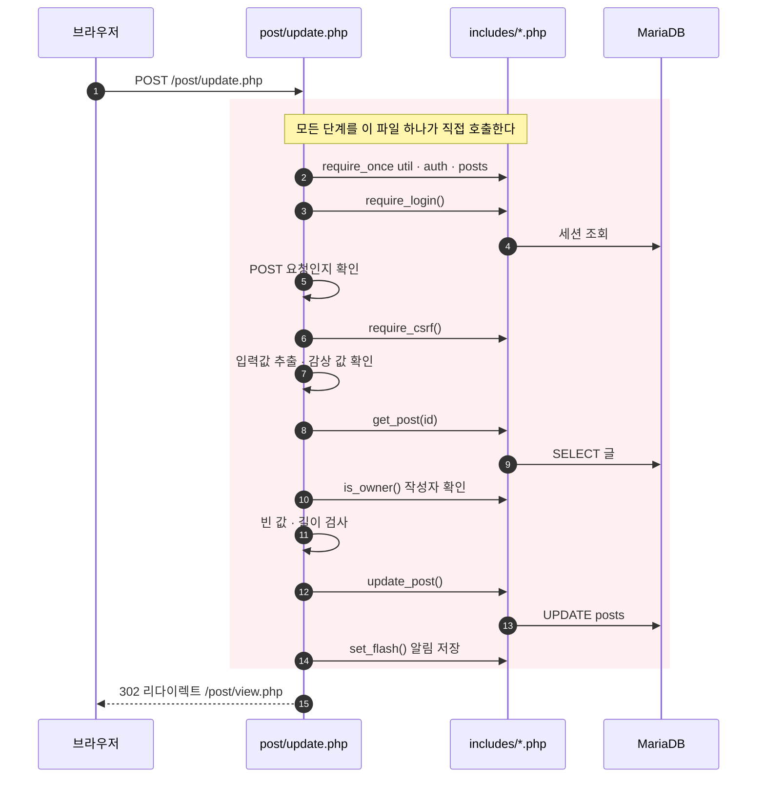
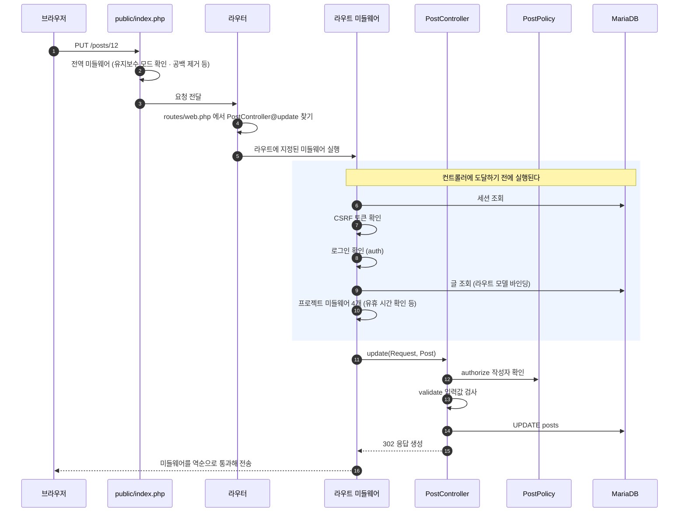

# 발표 원고 — Laravel 의 동작 방식과 코드 변화

레거시 vs 리팩토링 비교(① 규모 ~ ④ 화면) **앞에** 들어가는 부분이다.
코드는 모두 실제 파일에서 옮겼다. 레거시 코드는 이관 직전 커밋 `d92bc54^` 기준이다.

---

## 슬라이드 A-0. 폴더 구조 — 주소를 담던 폴더에서, 역할을 담는 폴더로

**가운데 · 오른쪽 — 폴더 트리 캡처**

- 가운데 — `lamp/src/week16` (week17 이관 직전과 같은 구조. week17 쪽은 이미 지웠다)
- 오른쪽 — `lamp/src/week17`
- 둘 다 폴더를 접은 채로 이름만 보이게 한다

**왼쪽 — 텍스트**

예시 사진은 기존 폴더 구조(가운데)와 라라벨 폴더 구조(오른쪽)

- 기존 — 폴더 이름이 곧 주소
  - `auth` `board` `comment` `post` … 주소용 폴더 16개
  - `includes/` — 화면들이 같이 쓰는 함수를 모아 둔 곳 (파일 31개)
  - 나머지는 자료 폴더 — `assets` `uploads` `sql` `cache`
- 라라벨 — 폴더 이름이 역할
  - 우리가 쓴 곳 — `app` `resources` `routes` `public`
  - 라라벨이 만들어 둔 곳 — `bootstrap` `config` `database` `storage` `tests` `vendor`
  - `sql` 은 양쪽에 다 있다 — 표는 그대로 쓴다

> 공개 범위(`public/` 하나로 좁아진 것)와 공용 코드(`require` 207곳)는 사진에 보이지 않는 사실이라 텍스트에서 뺐다.
> 공개 범위는 대본에서 말하고, 공용 코드는 슬라이드 D 에서 코드와 함께 나온다.

## 슬라이드 A-0-2. 폴더 구조 — 각 폴더 역할

(탐색기에 보이는 순서)

| 폴더 | 역할 | 우리가 쓴 것 |
|---|---|---|
| `app/` | 요청을 처리하는 코드 전부 | 46개 작성 |
| `bootstrap/` | 앱을 켜는 파일 — `app.php` 에 미들웨어를 등록한다 | 등록 부분만 수정 |
| `config/` | 설정값 묶음 — DB 접속 · 세션 · 인증 등 10개 | 값 몇 개 수정 |
| `database/` | 표를 만드는 마이그레이션 · 시더 | 안 씀 (기존 표를 그대로 쓴다) |
| `public/` | 브라우저가 닿는 유일한 폴더 — 입구 `index.php`, CSS · JS, 업로드 이미지 | 기존 CSS · JS 를 옮겨 둠 |
| `resources/` | `views/` 화면 30개 (Blade). `css/` `js/` 는 Vite 기본 파일이라 안 쓴다 | 화면 30개 작성 |
| `routes/` | 어떤 주소에 어떤 함수를 실행할지 (`web.php` · `console.php`) | 2개 작성 |
| `sql/` | 우리 표를 만든 SQL — 마이그레이션 21개 | 이관 전부터 있던 것, 유지 |
| `storage/` | 서버가 쓰는 작업 폴더 — 컴파일된 화면 · 로그 · 캐시 | 자동 생성 |
| `tests/` | 테스트 코드 | 기본 파일 그대로 |
| `vendor/` | 설치한 라이브러리 8,846개 (Laravel 본체 포함) | 건드리지 않음 |

`app/` 안 (질문이 더 들어오면)

| 폴더 | 역할 |
|---|---|
| `Http/` | `Controllers` 요청 처리 · `Middleware` 요청이 지나가는 길목 |
| `Models/` | 표 하나에 클래스 하나 (Post · Comment · User · Media …) |
| `Policies/` | 권한 판단 기준 (내 글인가) |
| `Providers/` | 앱을 켤 때 한 번 실행되는 등록 — 세션 드라이버 · 페이지 번호 화면 |
| `Services/` | 우리 규칙 (TMDB · 조회수 · 쿠키 동의 · 임시저장 · 기기 도장) |
| `Session/` | 세션을 우리 `sessions` 표에 담는 드라이버 |
| `Support/` | 검색어 형광펜 같은 작은 도구 |

- `vendor/` 8,846개는 규모를 셀 때 빼는 이유가 된다 — 남의 코드이기 때문이다 (뒤의 ① 규모 슬라이드와 이어진다)
- `sql/` 은 라라벨 마이그레이션을 쓰지 않기로 해서 남겼다 — 표를 만든 이력이 여기 있다

**발표 대본**

> 코드를 보기 전에 폴더부터 보겠습니다. 왼쪽이 원래 구조입니다.
> post, comment, auth 처럼 폴더 이름이 그대로 주소였습니다. 글 보기 화면을 만들려면 post 폴더에 view.php 를 만드는 식입니다.
> 그런 주소용 폴더가 열여섯 개였습니다.
> 주소가 아닌 코드 폴더는 includes 하나였습니다. 글을 읽어 오거나 로그인을 확인하는 것처럼
> 여러 화면이 똑같이 쓰는 함수를 파일 서른한 개에 모아 두고, 화면마다 필요한 것을 불러다 썼습니다.
>
> 오른쪽이 지금 구조입니다. 폴더 이름이 주소가 아니라 역할입니다.
> 주소는 routes 에 목록으로 적고, 요청을 처리하는 코드는 app 아래에, 화면은 resources 아래 views 에 있습니다.
>
> 사진에는 안 보이지만 하나 더 바뀐 것이 있습니다. 브라우저가 닿는 범위입니다.
> 예전에는 프로젝트 폴더 전체가 공개돼 있었는데, 지금은 public 폴더 하나뿐입니다.
> DB 비밀번호가 들어 있는 설정 파일과 소스 코드는 이제 그 바깥에 있습니다.
>
> 그럼 요청 하나가 이 폴더들을 어떤 순서로 지나가는지 보겠습니다.

---

## 슬라이드 A-0-3. 주소 목록 — 파일 위치가 정하던 주소를, 목록에 적는다

**왼쪽 — 코드 캡처** (`routes/web.php` 36~47행)

```php
Route::get('/posts',         [PostController::class, 'index']);
Route::get('/posts/create',  [PostController::class, 'create'])->middleware('auth');
Route::post('/posts',        [PostController::class, 'store'])->middleware('auth');
Route::get('/posts/{post}',  [PostController::class, 'show']);

Route::get('/posts/{post}/edit', [PostController::class, 'edit'])->middleware('auth');
Route::put('/posts/{post}',      [PostController::class, 'update'])->middleware('auth');
Route::delete('/posts/{post}',   [PostController::class, 'destroy'])->middleware('auth');
```

**오른쪽 — 터미널 캡처** (`php artisan route:list --path=posts`)

```text
GET|HEAD  posts                 PostController@index
POST      posts                 PostController@store
GET|HEAD  posts/create          PostController@create
GET|HEAD  posts/{post}          PostController@show
PUT       posts/{post}          PostController@update
DELETE    posts/{post}          PostController@destroy
```

**텍스트**

예시 사진은 글 관련 주소. 왼쪽이 적어 둔 코드, 오른쪽이 실제로 등록된 목록

- 이 파일은 실행되는 코드가 아니라 **등록 목록**이다. 앱이 켜질 때 한 번 읽어 표를 만든다
- 한 줄의 구성 — 요청 방식 · 주소 · 실행할 메서드 · 추가 조건
  - 같은 주소라도 방식이 다르면 다른 줄이다. 보기는 GET, 고치기는 PUT, 지우기는 DELETE
  - `{post}` 는 자리표시자다. 컨트롤러가 `Post $post` 로 받으면 그 번호로 글을 찾아 넣어 준다
- 뒤에 붙는 조건이 이 파일의 핵심이다
  - `->middleware('auth')` 로그인 필요 · `->middleware('throttle:5,1')` 1분에 5번까지
  - `->name('login')` 이름표 · `->withTrashed()` 지워진 글도 찾기
- 지금 51개 주소가 79줄에 등록되어 있다

- 레거시는 파일을 열어 봐야 그 화면의 조건을 알 수 있었다. 지금은 이 목록 한 장으로 보인다

**발표 대본**

> 폴더가 역할로 나뉘었다고 했는데, 그러면 주소는 누가 정하느냐. 이 파일이 정합니다.
>
> 왼쪽이 제가 적은 코드이고, 오른쪽은 그렇게 등록된 목록을 출력해 본 것입니다.
> 실행되는 코드가 아니라 등록입니다. 앱이 켜질 때 한 번 읽어서 이 표를 만들어 둡니다.
>
> 한 줄을 보면 요청 방식, 주소, 실행할 메서드, 그리고 추가 조건입니다.
> 같은 주소라도 방식이 다르면 다른 줄입니다. 글 하나를 보는 것과 고치는 것과 지우는 것이
> 주소는 같고 방식만 다릅니다.
> 중괄호로 쓴 부분은 자리표시자인데, 컨트롤러에서 타입만 적어 두면 그 번호로 글을 찾아서 넣어 줍니다.
>
> 뒤에 붙는 조건이 중요합니다. 로그인이 필요한 주소, 횟수를 제한하는 주소가 여기 다 드러납니다.
> 지금 쉰한 개 주소가 일흔아홉 줄에 적혀 있습니다.
> 예전에는 파일을 하나씩 열어 봐야 알 수 있던 것이, 목록 한 장이 됐습니다.

---

## 슬라이드 A-1. 레거시 — 요청 하나를, 파일 하나가 끝까지 처리한다

**왼쪽 위 — 코드** (캡처: `src/week16/post/update.php` 8~24행. 같은 파일이 week16 에 남아 있다)

```php
// ① 이 파일이 쓸 함수를 직접 불러온다 — 파일마다 목록이 조금씩 다르다
require_once __DIR__ . '/../includes/util.php';    // redirect() · post_str() · e()
require_once __DIR__ . '/../includes/auth.php';    // require_login() · is_owner()
require_once __DIR__ . '/../includes/posts.php';   // get_post() · update_post()

// ② 로그인 확인 — 화면에서 버튼을 숨겨도 요청은 직접 보낼 수 있다
require_login();

// ③ POST 요청인지 확인 — 주소창으로 열어서 실행되는 것을 막는다
if ($_SERVER['REQUEST_METHOD'] !== 'POST') {
    redirect('/');
}

// ④ CSRF 토큰 확인 — 다른 사이트가 흉내 내 보낸 POST 를 걸러낸다
require_csrf();

// ⑤ 여기서부터 글 수정 처리가 시작된다
```

**왼쪽 아래 — 텍스트**

예시 사진은 기존의 글 업데이트 기능

- ① 쓸 함수를 직접 불러오고
- ② 로그인했는지
- ③ POST 로 온 요청인지
- ④ 우리 화면에서 보낸 요청인지 확인
- 실제 수정은 ⑤ 부터 시작

- 주소 하나에 파일 하나가 대응
- 그 파일이 준비와 검사와 처리와 응답을 직접 호출
- 기능을 추가할 때마다 이 앞부분을 다시 쓰게 되고, 한 줄이라도 빠지면 그 파일만 문제가 생길 수 있음

**오른쪽 — 시퀀스 다이어그램**



**발표 대본**

> 글 수정을 처리하는 파일입니다. 그런데 화면에 보이는 이 부분에는 글을 고치는 코드가 없습니다.
> 위의 세 줄은 이 파일이 쓸 함수를 직접 불러오는 것이고, 그 아래 세 가지는 검사입니다.
> 로그인했는지, POST 로 온 요청인지, 우리 화면에서 보낸 요청인지를 확인합니다. 글 수정은 그다음부터 시작합니다.
>
> 이 앞부분은 이 파일만의 것이 아닙니다. 삭제 파일도, 댓글 작성 파일도 같은 여덟 줄로 시작합니다.
> 로그인 확인과 위조 요청 확인을 함께 호출하는 파일이 열여덟 개였습니다.
>
> 오른쪽은 이 파일이 끝까지 하는 일을 순서대로 그린 것입니다.
> 화살표 열다섯 개 중 열한 개가 이 파일에서 출발합니다. 준비도, 검사도, 저장도, 응답도 전부 이 파일이 직접 시킵니다.

---

## 슬라이드 A-2. Laravel — 같은 요청을, 여러 자리가 나눠서 처리한다

**왼쪽 위 — 코드** (캡처: `routes/web.php` 46행 + `app/Http/Controllers/PostController.php` 182행~, 주석 제외한 본문)

```php
// ① "PUT 방식으로 /posts/12 가 들어오면 PostController 의 update() 를 실행하라"
//    레거시는 주소가 곧 파일이었지만, 여기서는 어떤 주소에 어떤 함수를 실행할지 이 목록에 적어 둔다
//    ->middleware('auth') = 로그인한 사람만 이 주소에 닿을 수 있다
Route::put('/posts/{post}', [PostController::class, 'update'])->middleware('auth');

// ② 매개변수 Post $post — 주소의 번호로 글을 찾아 넣어 준다 (없으면 404)
public function update(Request $request, Post $post)
{
    $this->authorize('update', $post);             // ③ 작성자 확인 (기준은 PostPolicy)

    $data = $request->validate([                   // ④ 입력값 검사 — 규칙만 적는다
        'media_id'  => ['required', 'integer', 'exists:media,id'],
        'title'     => ['required', 'string', 'max:100'],
        'content'   => ['required', 'string', 'max:5000'],
        'sentiment' => ['required', 'in:호평,보통,혹평'],
    ]);

    $post->update($data);                          // ⑤ 저장 — 수정 시각도 함께 채워진다

    return redirect("/posts/{$post->id}")->with('status', '글을 수정했습니다.');
}
```

**왼쪽 아래 — 텍스트**

예시 사진은 같은 글 업데이트 기능

- ① 이 주소로 요청이 오면 어떤 함수를 실행할지 적어 두는 한 줄 (로그인 확인도 여기서 지정)
- ② 매개변수에 글이 담겨 들어옴 (없는 글이면 404)
- ③ 작성자 확인 · ④ 입력값 검사 · ⑤ 저장

- 앞 장의 ①~④ 중 불러오기 · 로그인 확인 · POST 확인 · CSRF 확인이 이 코드에 없음
- 사라진 게 아니라 컨트롤러 앞의 미들웨어로 자리를 옮긴 것 (오른쪽 파란 구간)
- 컨트롤러는 확인이 끝난 요청과 이미 찾아 둔 글을 받아 기능만 처리

**오른쪽 — 시퀀스 다이어그램** (미들웨어 순서는 실제 실행 순서)



**발표 대본**

> 같은 글 수정 요청을 Laravel 이 어떻게 처리하는지 보겠습니다.
> 맨 위 한 줄은 주소 등록입니다. PUT 방식으로 이 주소가 들어오면 PostController 의 update 를 실행하라는 뜻입니다.
> 레거시에서는 주소가 곧 파일이라 이런 줄이 필요 없었습니다. 대신 파일을 열어 봐야 그 안에서 무엇을 확인하는지 알 수 있었습니다.
> 끝에 붙은 auth 는 로그인한 사람만 이 주소에 닿을 수 있다는 표시입니다.
>
> 아래가 실제 처리 코드인데, 앞 장에서 본 네 가지가 여기에는 없습니다.
> 함수를 불러오는 줄도 없고, 로그인 확인도, POST 확인도, 위조 요청 확인도 없습니다.
> 심지어 수정할 글을 찾는 코드도 없습니다. 매개변수에 이미 담겨 들어옵니다.
>
> 없어진 것이 아니라 자리를 옮긴 것입니다. 오른쪽 파란 부분이 그 자리입니다.
> 요청이 컨트롤러에 닿기 전에 세션을 읽고, 토큰을 확인하고, 로그인을 확인하고, 수정할 글까지 찾아 둡니다.
> 그래서 컨트롤러는 작성자 확인과 값 검사와 저장만 합니다.
>
> 앞 장에서는 파일 하나가 전부 직접 호출했습니다. 여기서는 요청이 지나가는 길목에 한 번만 두고, 각 기능은 자기 일만 합니다.

> 출처 — [Laravel 13.x · Request Lifecycle](https://laravel.com/docs/13.x/lifecycle)
> - "The entry point for all requests to a Laravel application is the `public/index.php` file."
> - "Once the application has been bootstrapped and all service providers have been registered, the `Request` will be handed off to the router for dispatching. The router will dispatch the request to a route or controller, as well as run any route specific middleware."
> - "If the request passes through all of the matched route's assigned middleware, the route or controller method will be executed and the response returned by the route or controller method will be sent back through the route's chain of middleware."

---

## 슬라이드 C-1. 로그인 · 위조 요청 확인 — 파일마다 부르던 것을, 주소 목록 한 곳에서

**왼쪽 — 레거시 캡처**

- VS Code 검색창(Ctrl+Shift+F)에서 `lamp/src/week16` 을 대상으로 `require_login();` 검색
  - ★ **세미콜론까지 넣어야** 실제 호출만 잡힌다 → **23개 파일 · 23건**
  - 세미콜론을 빼면 `includes/auth.php` 의 함수 정의와 주석까지 잡혀 25개 파일 · 28건이 된다
- 같은 방법으로 `require_csrf();` → **24개 파일**

**오른쪽 — Laravel 캡처**

- `routes/web.php` 36~47행 — 주소마다 `->middleware('auth')` 가 붙어 있는 부분

```php
Route::get('/posts/create',  [PostController::class, 'create'])->middleware('auth');
Route::post('/posts',        [PostController::class, 'store'])->middleware('auth');
Route::get('/posts/{post}',  [PostController::class, 'show']);          // 로그인 없이 볼 수 있다
Route::get('/posts/{post}/edit', [PostController::class, 'edit'])->middleware('auth');
Route::put('/posts/{post}',      [PostController::class, 'update'])->middleware('auth');
Route::delete('/posts/{post}',   [PostController::class, 'destroy'])->middleware('auth');
```

**텍스트**

예시 사진은 로그인 확인을 어디에 적는지. 왼쪽은 레거시 검색 결과, 오른쪽은 라라벨 주소 목록

- 왼쪽 — `require_login();` 을 검색한 결과. 파일 23개가 각자 이 줄을 갖고 있다
  - 로그인이 필요한 화면을 만들 때마다 이 줄을 직접 쓴다
  - 한 파일에서 빠뜨리면 그 주소만 검사 없이 통과한다
  - 위조 요청 확인(`require_csrf();`)도 같은 방식이라 24개 파일에 들어 있다
- 오른쪽 — 주소를 등록하는 줄 끝에 `->middleware('auth')` 를 붙인다
  - 로그인이 필요한 주소 21곳에 붙어 있다
  - 글 보기에는 안 붙어 있다. 로그인 없이 볼 수 있다는 뜻
  - 위조 요청 확인은 아예 안 적는다. 모든 POST 에 기본으로 적용된다

- 검사가 사라진 게 아니라, 적는 자리가 바뀌었다
- 파일을 열어 봐야 알던 것을, 목록 한 장으로 확인한다

**발표 대본**

> 로그인 확인과 위조 요청 확인입니다. 둘 다 요청이 코드에 닿기 전에 해야 하는 검사입니다.
> 왼쪽은 검색 결과입니다. 로그인 확인을 부르는 파일이 스물세 개, 위조 요청 확인이 스물네 개였습니다.
> 새 기능을 만들 때마다 이 두 줄을 다시 써야 했고, 빠뜨린 파일이 있는지 확인하려면 이렇게 검색해서 하나씩 열어 보는 수밖에 없었습니다.
>
> 오른쪽은 지금의 주소 목록입니다. 주소를 등록하면서 로그인 확인을 함께 지정합니다.
> 목록만 보면 어느 주소가 로그인이 필요한지 한눈에 보입니다. 글 보기에는 안 붙어 있는 것도 바로 보입니다.
>
> 설정 화면들은 로그인 확인에 더해 비밀번호 재확인까지 필요해서, 다섯 개를 따로 묶어 뒀습니다.
>
> 위조 요청 확인은 아예 지정하지 않습니다. 모든 POST 요청에 기본으로 적용되기 때문입니다.
> 화면에서는 폼 안에 @csrf 한 줄만 씁니다. 지금 열두 개 화면이 그렇게 돼 있습니다.
>
> 검사 자체가 없어진 것이 아니라, 검사를 적는 자리가 바뀐 것입니다.

---

## 슬라이드 C-2. 입력값 검사 — 확인하고 되돌리는 절차를, 규칙 목록으로

**왼쪽 — 레거시 캡처** (`src/week16/auth/register.php` 20~53행)

```php
$username = trim(post_str('username'));
$password = post_str('password', '');

keep_old_input(['username' => $username]);          // 실패하면 되살릴 값을 맡겨 둔다

if ($username === '' || mb_strlen($password) < 4) {
    set_flash('❌ 아이디를 입력하고, 비밀번호는 4자 이상으로 정해 주세요.', 'error');
    redirect('/auth/signup.php');
}
if (find_user($username) !== null) {
    set_flash('❌ 이미 있는 아이디입니다.', 'error');
    redirect('/auth/signup.php');
}

$newId = create_user($username, $password);
if ($newId === 0) {
    set_flash('❌ 이미 있는 아이디입니다.', 'error');
    redirect('/auth/signup.php');
}

forget_old_input();                                  // 성공했으니 맡겨 둔 값을 지운다
```

**오른쪽 — Laravel 캡처** (`Auth/RegisterController.php` + `auth/register.blade.php`)

```php
$data = $request->validate([
    'username' => ['required', 'string', 'max:20', 'unique:users,username'],
    'password' => ['required', 'string', 'min:4'],
], [
    'username.unique' => '이미 있는 아이디입니다.',
    'password.min'    => '비밀번호는 4자 이상으로 정해 주세요.',
]);
```

```blade
<input type="text" name="username" required value="{{ old('username') }}" maxlength="20">
@error('username')<span class="muted">{{ $message }}</span>@enderror
```

**텍스트**

예시 사진은 회원가입 처리. 왼쪽이 레거시, 오른쪽이 라라벨

- 왼쪽 — 확인과 뒤처리를 순서대로 직접 쓴다
  - 실패하면 되살릴 값을 따로 맡겨 두고(`keep_old_input`), 성공하면 지운다
  - 조건마다 `if` — 어기면 메시지를 저장하고 폼으로 되돌린다
  - 아이디 중복은 두 번 확인한다 (미리 한 번, 저장이 실패해서 또 한 번)
- 오른쪽 — 어떤 값이 어때야 하는지만 적는다
  - `required` `max:20` `unique:users,username` — 확인 방법을 이름으로 지정
  - 어겼을 때 되돌리기 · 메시지 · 값 복원은 프레임워크가 한다
  - 화면에서는 `old()` 로 값을, `@error` 로 메시지를 꺼내 쓴다

- 검사 항목은 그대로다. 사라진 것은 '어겼을 때 할 일'을 매번 쓰는 부분
- 빠뜨리기 쉬운 중복 확인도 규칙 한 줄(`unique`)로 끝난다

**발표 대본**

> 입력값 검사입니다. 왼쪽은 회원가입을 처리하던 코드입니다.
> 값을 꺼내고, 실패했을 때 폼에 다시 채워 넣을 아이디를 따로 맡겨 둡니다.
> 그다음 조건마다 if 를 씁니다. 어기면 메시지를 저장하고 가입 폼으로 되돌립니다.
> 아이디 중복은 두 번 확인합니다. 미리 한 번 보고, 저장이 실패하면 또 한 번 봅니다.
> 마지막에 맡겨 둔 값을 지웁니다. 검사 자체보다 어겼을 때 할 일을 쓰는 코드가 더 깁니다.
>
> 오른쪽은 지금입니다. 어떤 값이 어때야 하는지만 적습니다.
> 아이디는 필수이고, 스무 자 이하이고, users 표에 같은 값이 없어야 한다.
> 조건을 어겼을 때 폼으로 되돌리고, 메시지를 붙이고, 입력값을 다시 채우는 일은 프레임워크가 합니다.
> 화면에서는 old 로 값을, @error 로 메시지를 꺼내 쓰기만 합니다.
>
> 검사 항목이 줄어든 것이 아닙니다. 어겼을 때 할 일을 매번 쓰던 부분이 사라진 것입니다.

---

## 슬라이드 D-1. DB 다루기 — JOIN 과 서브쿼리를 직접 쓰던 것을, 관계 이름으로

**왼쪽 — 레거시 캡처** (`src/week16/includes/posts.php` 27~55행, `get_posts()`)

```php
$sql = "
    SELECT
        p.id, m.slug AS work, m.title AS workTitle, p.title,
        u.username AS author, u.nickname AS authorNick,
        p.sentiment, p.views, p.content,
        UNIX_TIMESTAMP(p.created_at) AS created,
        UNIX_TIMESTAMP(p.edited_at)  AS edited,
        (SELECT COUNT(*) FROM comments c WHERE c.post_id = p.id) AS comments,
        (SELECT COUNT(*) FROM likes    l WHERE l.post_id = p.id) AS likes,
        (SELECT COUNT(*) FROM posts pc WHERE pc.author_id = p.author_id
                                         AND pc.deleted_at IS NULL) AS authorPostCount
    FROM posts p
    JOIN media m ON p.media_id  = m.id
    JOIN users u ON p.author_id = u.id
    WHERE p.deleted_at IS NULL
    ORDER BY p.id DESC
";
return db()->query($sql)->fetchAll();
```

**오른쪽 — Laravel 캡처** (`app/Models/Post.php` + `PostController@index`)

```php
// 표 사이의 관계를 모델에 한 번 적어 둔다
public function author():  BelongsTo     { return $this->belongsTo(User::class, 'author_id'); }
public function media():   BelongsTo     { return $this->belongsTo(Media::class, 'media_id'); }
public function comments(): HasMany      { return $this->hasMany(Comment::class, 'post_id'); }
public function likers():  BelongsToMany { return $this->belongsToMany(User::class, 'likes', 'post_id', 'user_id'); }

// 화면에서는 필요한 것만 이름으로 말한다
$posts = Post::with(['author' => fn ($q) => $q->withCount('posts')])
             ->withCount(['comments', 'likers'])
             ->paginate($perPage);
```

**텍스트**

예시 사진은 글 목록을 읽어 오는 코드. 왼쪽이 레거시, 오른쪽이 라라벨

- 왼쪽 — SQL 문자열을 직접 조립한다
  - `JOIN` 2개로 작품과 작성자를 잇고, 서브쿼리 3개로 댓글 수 · 추천 수 · 작성자 글 수를 센다
  - `WHERE p.deleted_at IS NULL` — 지운 글을 빼는 조건을 조회마다 직접 쓴다
  - 돌려주는 것은 배열이다. 글 190개를 한 번에 다 읽어 온다
- 오른쪽 — 표 사이의 관계를 모델에 한 번 적어 두고, 필요한 것만 이름으로 부른다
  - `with('author')` 는 작성자를, `withCount('comments')` 는 댓글 수를 붙인다
  - 지운 글 제외는 모델의 `SoftDeletes` 한 줄이 맡는다
  - 돌려주는 것은 객체다. 화면에서 `$post->author->nickname` 처럼 점으로 타고 들어간다

- SQL 문자열을 직접 실행하던 지점 79곳 → 0곳
- 남은 것은 우리 프로젝트만의 계산식 11곳 (인기 정렬 기준, 답글 정렬 등)

**발표 대본**

> DB 를 다루는 코드입니다. 왼쪽은 글 목록을 읽어 오던 함수입니다.
> 표 세 개를 이어 붙이고, 댓글 수와 추천 수와 작성자의 글 수를 서브쿼리 세 개로 셉니다.
> 지운 글을 빼는 조건도 여기 직접 적혀 있습니다. 조회하는 곳마다 이 조건을 다시 써야 했습니다.
> 그리고 이 함수는 글 백구십 개를 전부 읽어 옵니다.
>
> 오른쪽은 지금입니다. 위쪽은 모델에 적어 둔 관계입니다.
> 글에는 작성자가 있고, 작품이 있고, 댓글이 여럿 있고, 추천한 사람이 여럿 있다.
> 이걸 한 번 적어 두면 아래처럼 이름으로 부르기만 하면 됩니다.
> 작성자를 같이 가져와라, 댓글 수를 세어 붙여라.
> 지운 글을 빼는 조건은 모델에 붙인 한 줄이 알아서 겁니다.
>
> SQL 문자열을 직접 실행하던 자리가 일흔아홉 곳이었는데 지금은 없습니다.
> 남은 것은 인기 정렬 기준처럼 우리 프로젝트에서만 쓰는 계산식 열한 곳뿐입니다.
> 프레임워크가 알 수 없는 내용이라 그건 우리가 씁니다.

---

## 슬라이드 D-2. 게시판 페이징 — 전부 읽어 자르던 것을, DB 가 자르게

**왼쪽 — 레거시 캡처** (`src/week16/board/index.php` 109~122행 + 페이지 링크 마크업)

```php
$posts = get_posts();                                   // 글 190개를 전부 읽어 온다
$posts = filter_posts_by_work($posts, $work);           // ① 이 작품 글만
$posts = search_posts($posts, $q);                      // ② 검색어로 추리기
$posts = filter_posts_by_sentiment($posts, $sentiment); // ③ 호평·혹평으로 추리기
$posts = sort_posts($posts, $sort);                     // ④ 정렬

$totalCount = count($posts);
$totalPages = max(1, (int) ceil($totalCount / $perPage));
if ($page > $totalPages) { $page = $totalPages; }       // 범위를 넘으면 마지막 페이지로
$pagePosts = paginate_posts($posts, $page, $perPage);   // array_slice 로 이 페이지 분량만
```

```php
<!-- 그리고 화면에서 이전 · 번호 · 다음 링크를 직접 그린다 (18줄) -->
<nav class="pagination">
  <?php if ($page > 1): ?>
    <a class="page-nav" href="<?= e(query_url('/board/', ['page' => $page - 1])) ?>">← 이전</a>
  <?php else: ?>
    <span class="page-nav disabled">← 이전</span>
  <?php endif; ?>
  ...
```

**오른쪽 — Laravel 캡처**

```php
$posts = Post::where('media_id', $media->id)->paginate(15);
```

```blade
{{ $posts->links() }}
```

**텍스트**

예시 사진은 작품 게시판의 페이징. 위가 레거시, 아래 둘이 라라벨

- **거르고 정렬하는 일을 누가 하나**
  - 레거시 — PHP 가 한다. 글 190개를 배열로 받아 온 뒤 그 배열을 훑어서 거르고 정렬한다
  - 라라벨 — DB 가 한다. 조건을 SQL 에 쌓아 두었다가 마지막에 한 번 보낸다
- **DB 에 얼마나 물어보나**
  - 레거시 — 화면을 열면 곧바로 `SELECT` 한 번. 조건과 상관없이 전부 가져온다
  - 라라벨 — `paginate()` 를 부르는 순간 두 번. 전체 개수 한 번, 그 페이지 15개 한 번
- **페이지 번호는 누가 계산하나**
  - 레거시 — 개수를 세고, 나눠 올리고, 범위를 넘으면 마지막 페이지로 되돌린다. 전부 직접
  - 라라벨 — `paginate()` 가 한다. 주소의 `?page=` 를 읽는 것도 포함
- **화면에 링크를 어떻게 그리나**
  - 레거시 — 이전 · 번호 · 다음 마크업을 화면마다 직접 쓴다 (3곳)
  - 라라벨 — `links()` 한 줄. 모양은 우리가 만든 파일 한 벌을 8개 화면이 함께 쓴다
- **페이지를 넘길 때 조건 유지**
  - 레거시 — `query_url()` 로 작품 · 검색어 · 정렬을 주소에 다시 붙인다
  - 라라벨 — `withQueryString()` 한 줄

- 아래가 길어 보이는 건 조건의 내용까지 펼쳐서다. 레거시의 그 부분은 다른 파일에 97줄로 있다

**줄 수 근거** (질문이 나오면)

| | 레거시 | 라라벨 |
|---|---|---|
| 부르는 쪽 | 9줄 | 6줄 (`WorkController` 77~82행) |
| 조건의 내용 | 97줄 — `get_posts` 29 · `search_posts` 30 · `sort_posts` 13 · `filter_posts_by_sentiment` 12 · `filter_posts_by_work` 9 · `paginate_posts` 4 | 18줄 (`Post::scopeBoard`) |
| 페이지 링크 | 18줄 × 3곳 | 29줄 × 1곳 + 부르는 곳 8군데 모두 한 줄 |
| 합계 | 124줄 | 54줄 |

**발표 대본**

> 게시판 페이징입니다. 선정 발표에서 라라벨은 이 기능을 프레임워크가 준다고 했던 항목입니다.
>
> 왼쪽이 원래 코드입니다. 먼저 글 백구십 개를 전부 읽어 옵니다.
> 그다음 작품으로 거르고, 검색어로 거르고, 감상으로 거르고, 정렬합니다.
> 그러고 나서 개수를 세고, 페이지 수를 계산하고, 범위를 넘는 번호를 막고, 배열을 잘라냅니다.
> 화면에서는 이전, 번호, 다음 링크를 직접 그렸습니다. 같은 열여덟 줄이 세 군데 있었습니다.
>
> 오른쪽은 지금입니다. 한 페이지에 몇 개를 볼지만 말하면, DB 가 그만큼만 가져옵니다.
> 지금이 몇 페이지인지 주소에서 읽는 것도, 링크를 만드는 것도 프레임워크가 합니다.
>
> 아래 코드가 더 길어 보이실 텐데, 비교 조건이 다릅니다.
> 위 사진은 부르는 쪽만 보여줍니다. 실제 거르고 정렬하는 코드는 다른 파일에 함수 여섯 개, 아흔일곱 줄로 있었습니다.
> 아래는 부르는 쪽과 그 내용을 둘 다 펼친 것입니다. 같은 조건으로 다 세면 백스물네 줄에서 쉰네 줄입니다.
>
> 그런데 줄 수보다 중요한 게 있습니다. 오른쪽에서 짚을 수 없는 자리가 넷입니다.
> 개수 세기, 페이지 수 계산, 범위를 넘는 번호 막기, 배열 자르기입니다. 대응하는 코드가 아예 없습니다.
> 그리고 줄 수에 안 나타나는 차이가 하나 더 있습니다. 예전에는 백구십 개를 읽어서 열다섯 개만 남겼고, 지금은 DB 가 열다섯 개만 줍니다.
>
> 다만 기본 링크 모양이 우리 화면과 맞지 않아서 페이지 번호 화면은 직접 만들었습니다.
> 대신 프로젝트 전체에 한 벌만 두면 됩니다. 그 이야기는 뒤에서 한 번 더 하겠습니다.

---

## 슬라이드 E. 프레임워크 기본 동작과 프로젝트 규칙이 충돌한 사례

자동 처리는 **Laravel 의 규약**을 따른다. 프로젝트 규칙이 규약과 다르면 별도 설정이 필요하다.

- **`(수정됨)` 표시 오류**
  - 프로젝트 규칙 — `edited_at` 은 **수정한 적이 있을 때만** 값을 가진다
  - Laravel 기본 동작 — 수정 시각 컬럼을 **생성 시점에도** 채운다
  - 조치 — 글 생성 시 해당 컬럼을 비워 두는 처리를 모델에 추가했다
- **페이지 번호 스타일 불일치**
  - `{{ $posts->links() }}` 의 기본 HTML 은 Tailwind CSS 기준이라 프로젝트 CSS 가 적용되지 않았다
  - 조치 — 기존 마크업으로 페이지 번호 뷰를 작성하고 기본 뷰로 지정했다
  > 출처 — [Laravel 13.x · Pagination](https://laravel.com/docs/13.x/pagination#customizing-the-pagination-view)
  > "By default, the views rendered to display the pagination links are compatible with the Tailwind CSS framework. However, if you are not using Tailwind, you are free to define your own views to render these links."
- **정리** — 자동 처리 기능은 **무엇을 대신 처리하는지 확인한 뒤** 사용해야 한다
  - 뒤의 ③ 그래도 남은 것 · ④ 화면으로 이어진다

---

## 발표 순서 (제안)

1. A-0 — 폴더 구조 비교
2. A-0-2 — 각 폴더 역할
3. A-0-3 — 주소 목록
3. A-1 · A-2 — 레거시와 Laravel 의 요청 처리 흐름
2. B — 동일 기능의 전체 코드 비교
3. C · D — 프레임워크가 대신하는 코드 (시간이 부족하면 1 · 5 · 6 · 7 만)
4. E — 기본 동작과 프로젝트 규칙의 충돌
5. 이어서 ① 규모 → ② 반복이 사라진 자리 → ③ 그래도 남은 것 → ④ 화면
