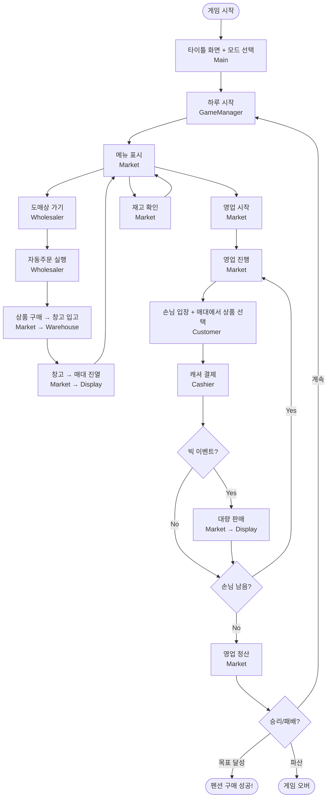

# CLAUDE.md

이 파일은 Claude Code (claude.ai/code)가 이 저장소의 코드를 다룰 때 참고하는 안내 문서입니다.

## 프로젝트 개요

팀노바 기초반 4주차 Java 학습 프로젝트입니다. IntelliJ IDEA를 사용합니다.

## 협업 방식

- **대화 기반 점진적 개발**: 한번에 전체 코드를 작성하지 않음
- **뼈대 먼저**: 프로그램 구조/설계를 먼저 대화로 확정
- **단계별 구현**: 설계 확정 후 기능 하나씩 구현하며 진행
- **매 단계 컨펌**: 각 단계마다 사용자 확인 후 다음 진행

## 빌드 및 실행

IntelliJ IDEA의 내장 컴파일러를 사용합니다. 커맨드라인에서 실행하려면:

```bash
# 컴파일
javac -d out src/*.java

# 실행
java -cp out Main
```

## 프로젝트 구조

- `src/` - Java 소스 파일 (진입점: `Main.java`)
- `out/` - 컴파일된 클래스 파일 (gitignore 처리됨)

## 개발 프로세스

1. **설계**: 구현 전 구조/로직 설계 및 컨펌
2. **구현**: 점진적으로 코드 작성, 각 단계마다 컨펌
3. **검증**: 조건에 맞는지 테스트 및 확인

## 개발 규칙

- **점진적 커밋**: 모든 커밋은 사용자 컨펌 후 진행 (커밋은 사용자가 직접, 메시지만 제공)
- **주석 필수**: 변수명, 로직 전개, 타입 선택에 대한 근거를 주석으로 작성
- **단계별 진행**: 기능 하나씩 구현 후 확인
- **변수 선언**: 쉼표로 구분하지 말고 각 변수를 개별 라인에 선언
  ```java
  // 나쁜 예
  int a = 1, b = 2, c = 3;

  // 좋은 예
  int a = 1;
  int b = 2;
  int c = 3;
  ```
- **조건문 선택 기준 (if-else vs switch)**:
  - `if-else`: 복합 조건 (범위 비교, AND/OR 조합, null 체크, 객체 비교)
  - `switch`: 단일 값으로 여러 분기 처리 (메뉴 선택, 열거형 등)
  ```java
  // if-else 사용: 범위/복합 조건
  if (score >= 90) {
      grade = "A";
  } else if (score >= 80) {
      grade = "B";
  }

  // switch 사용: 단일 값 → 여러 분기
  switch (choice) {
      case 1:
          goWholesaler();
          break;
      case 2:
          startBusiness();
          break;
  }
  ```
- **접근한정자 필수**: 모든 필드와 메서드에 적절한 접근한정자를 반드시 명시 (package-private 금지)
  - `private`: 클래스 내부에서만 사용하는 필드/메서드 (기본값으로 사용)
  - `public`: 외부 클래스에서 접근해야 하는 필드/메서드
  - 접근한정자 없이 선언하지 않는다 (Java의 package-private는 의도가 불명확)
  ```java
  // 나쁜 예: 접근한정자 생략 (package-private)
  int money;
  void startBusiness() { ... }

  // 좋은 예: 의도를 명확히
  private int money;
  public void startBusiness() { ... }
  ```
- **메서드 주석 스타일**: 메서드 설명은 `/// <summary>` 형식 사용
  ```java
  /// <summary>
  /// 메서드 설명
  /// </summary>
  void someMethod() {
      // ...
  }
  ```
- **try-catch 사용 원칙**: 실제 예외가 발생할 수 있는 상황에서만 사용
  - **사용하지 말 것**: 단순 입력 검증 (숫자 파싱 등) → `hasNextInt()` 같은 검증 메서드 활용
  - **불가피한 경우**: Java checked exception (Thread.sleep, System.in 등)
    - 컴파일러 요구사항임을 주석으로 명시
  ```java
  // 나쁜 예: 입력 검증에 try-catch 사용
  try {
      int num = Integer.parseInt(input);
  } catch (NumberFormatException e) {
      num = 0;
  }

  // 좋은 예: 검증 메서드 사용
  if (scanner.hasNextInt()) {
      int num = scanner.nextInt();
  } else {
      scanner.next();  // 잘못된 입력 소비
      int num = 0;
  }

  // 불가피한 경우: checked exception (주석 필수)
  // 주의: Thread.sleep()은 checked exception이라 try-catch 필수 (컴파일러 요구)
  try {
      Thread.sleep(ms);
  } catch (InterruptedException e) {
      // 단일 스레드 앱에서는 발생하지 않음 (컴파일러 요구사항)
  }
  ```

## 4주차 과제

**목표**: 클래스와 메서드 활용 익히기 (상속 없이)

**과제 내용**: 가게 운영 시뮬레이션 게임
- 다수의 클래스 사용으로 구조 이해
- 노가다성 있는 구현으로 문법 체화
- 혼자 하는 게임 (1인 플레이)

### 게임 설정

**배경**: 강릉 펜션 근처 작은 슈퍼마켓 운영
**스토리**: 슈퍼마켓으로 돈을 벌어 펜션 주인이 되자!

### 게임 수치

| 항목 | 수치 |
|------|------|
| 초기 자본 | 5,000만원 |
| 목표 금액 | 3억원 |
| 매대 슬롯 | 30칸 |
| 하루 손님 | 10~20명 |
| 패배 조건 | 파산 (자본 0원) |

**수치 근거:**
- **초기 자본 5,000만원**: 소규모 슈퍼마켓 창업 비용이 5,000만원~1억원 수준 (소상공인 창업 통계 기준)
- **목표 금액 3억원**: 강릉 지역 소형 펜션/전원주택 매매가 3억~7억원대 (강릉교차로 부동산 매물 기준)
- **매대 슬롯 30칸**: 작은 슈퍼마켓 규모 + 게임 전략성을 위한 제한 (게임 밸런스)
- **하루 손님 10~20명**: 펜션촌 비수기/성수기 유동 인구 고려, 일반 편의점(일 200~300명)보다 적게 설정
- **참고 자료**: [편의점 쇼퍼 트렌드 2024](https://retailtalk.co.kr), [강릉교차로 부동산](https://mland.gnkcr.com)

### 설계 원칙

- **손님이 직접 고른다**: Customer가 매대(Display)에서 상품을 직접 선택 (`pickProducts`)
- **캐셔는 계산만**: Cashier는 손님이 가져온 상품의 결제만 처리 (`checkout`)
- **가게가 영업**: Market이 영업 주관 (손님 입장 → 매대에서 상품 선택 → 캐셔 결제 → 매출 반환)
- **돈은 반환 방식**: Market이 영업 후 매출을 GameManager에게 반환 (`money += market.startBusiness()`)

### 클래스 구조

```
Main (타이틀 화면 + 게임 모드 선택)
 └─ GameManager (게임 루프 + 시간 관리 + 승리/패배 판정)
     ├─ Market (가게: 영업 + 메뉴 UI + 창고/매대/캐셔 + 재고 관리)
     │   ├─ Warehouse (창고)
     │   ├─ Display (매대)
     │   └─ Cashier (계산대: 결제 전용)
     ├─ ProductCatalog (상품/카테고리 데이터 저장소)
     └─ Wholesaler (도매상: 구매/자동주문)
```

| 클래스 | 역할 |
|--------|------|
| `Main` | 타이틀 화면 + 게임 모드(기본/커스텀) 선택 → GameManager 생성 |
| `GameManager` | 게임 루프, 시간 관리(아침/낮/밤), 승리/패배 판정, 게임 상태(money/day) 보유 |
| `Market` | 가게 전체: 영업(손님→캐셔→매출 반환) + 메뉴 UI + 창고/매대/캐셔 소유 + 재고 관리 + 빅이벤트 |
| `ProductCatalog` | 상품 50개 + 카테고리 10개 데이터, 상품명 검색(Map) |
| `Wholesaler` | 도매상 카테고리별 구매, 자동주문 정책 설정/실행 |
| `Cashier` | 결제 전용: 상품 합산 → 매대 재고 차감 → 결과(매출/이익/성공/실패) 반환 |
| `Customer` | 손님 데이터 + 유형별 쇼핑 패턴 + 매대에서 직접 상품 선택(pickProducts), 인사말 상수 |
| `Product` | 상품 데이터 (이름, 매입가, 판매가, 인기도, 박스크기) |
| `Category` | 카테고리 데이터 (이름, 상품 배열, 자동주문 정책, 인덱스 상수) |
| `Warehouse` | 창고 재고 관리 (HashMap 기반) |
| `Display` | 매대 슬롯 관리 (진열/판매/회수) |
| `Util` | 유틸리티 (입력, 랜덤, 딜레이, 화면 클리어 등) |

**공유 상태 접근 방식:** `money`, `day`, `timeOfDay`는 GameManager가 보유, 협력 객체들이 `game.money` 등으로 직접 접근

**손님 유형 (Customer 내부 상수):**
- `TYPE_FAMILY(0)` - 가족: 고기+식재료+음료 필수, 안주/아이스크림 선택
- `TYPE_COUPLE(1)` - 커플: 소주+맥주+안주 필수, 음료/아이스크림 선택
- `TYPE_FRIENDS(2)` - 친구들: 맥주+소주+안주 필수, 아이스크림/폭죽 선택
- `TYPE_SOLO(3)` - 혼자: 라면+맥주 필수, 음료/아이스크림/안주 선택

**카테고리 인덱스 (Category 내부 상수):**
- `INDEX_DRINK(0)`, `INDEX_BEER(1)`, `INDEX_SOJU(2)`, `INDEX_SNACK(3)`, `INDEX_MEAT(4)`
- `INDEX_BEACH(5)`, `INDEX_GROCERY(6)`, `INDEX_RAMEN(7)`, `INDEX_ICECREAM(8)`, `INDEX_FIREWORK(9)`

### 게임 시스템

**매대 시스템:**
- 총 30칸 슬롯 제한
- 상품 입고 시 슬롯 사용
- 전략적 상품 선택 필요

**손님 선호도 가중치:**
- 높음: 맥주, 소주, 삼겹살, 목살, 폭죽, 선크림
- 중간: 라면, 상추, 쌈장, 음료
- 낮음: 기타

**손님 응대:**
- 손님이 원하는 상품 요청
- 재고 있으면 판매, 없으면 손님 떠남

### 빅 이벤트 (게임 가속)

**1. 단체 주문** - 근처 수련회에서 대량 주문
**2. 펜션 배달** - 바베큐 세트 등 배달 요청
**3. 축제 시즌** - 강릉 불꽃축제 등, 특정 상품 수요 급증

### 스킵 시스템

| 옵션 | 설명 |
|------|------|
| 직접 영업 | 손님 한 명씩 응대 (현재 기본 방식) |
| 빠른 영업 | 하루 결과만 요약 출력 (손님 상세 생략) |
| 1주일 스킵 | 7일 자동 영업, 주간 요약만 확인 (빅 이벤트 발생 시 알림) |

### 게임 플로우차트



### UI 예시 (아스키 아트 스타일)

**게임 시작:**
```
========================================
     _____
    / ____|
   | (___  _   _ _ __   ___ _ __
    \___ \| | | | '_ \ / _ \ '__|
    ____) | |_| | |_) |  __/ |
   |_____/ \__,_| .__/ \___|_|
                | |
                |_|   @ Gangneung
========================================
목표: 3억원 모아서 펜션 사기!
시작 자본: 5,000만원

[1] 게임 시작
[0] 종료
>>
```

**하루 시작:**
```
========================================
          [  1일차 - 아침  ]
========================================
현재 자본: 50,000,000원
매대 현황: 0 / 30칸

[1] 도매상 가기 (상품 입고)
[2] 영업 시작
[3] 현재 재고 확인
[0] 게임 종료
>>
```

**도매상:**
```
========================================
            [ 도매상 ]
========================================
현재 자본: 50,000,000원
매대: 5 / 30칸

--- 음료 ---
1. 콜라     | 매입 800원  | 판매 1,500원
2. 사이다   | 매입 800원  | 판매 1,500원

구매할 상품 번호 (0: 돌아가기)
>> 1
수량 입력 >> 10
[OK] 콜라 10개 구매 완료! (-8,000원)
```

**손님 응대:**
```
========================================
     [ 손님 1/15 - 가족 손님 ]
========================================
"안녕하세요! 저희 바베큐 하려고요~"

원하는 상품:
 - 삼겹살 2팩
 - 소주 4병

[1] 판매하기
[2] 재고 확인
>> 1

[OK] 삼겹살 2팩 판매! (+30,000원)
[--] 소주 재고 없음...
```

**정산:**
```
========================================
          [ 1일차 정산 ]
========================================
오늘 방문 손님: 15명
판매 성공: 42건
판매 실패: 8건

----------------------------------------
  오늘 매출:    285,000원
  순이익:      +135,000원
----------------------------------------
  현재 총 자본: 50,135,000원
  목표까지:     249,865,000원
========================================

[1] 다음 날로
[0] 게임 종료
>>
```

**빅 이벤트:**
```
========================================
      *** 전화가 왔습니다! ***
========================================
"여기 수련회인데요, 대량 주문할게요!"

 - 콜라 15개   (재고: 20) [OK]
 - 과자 20개   (재고: 25) [OK]

[1] 판매하기
[2] 거절하기
>>
```
