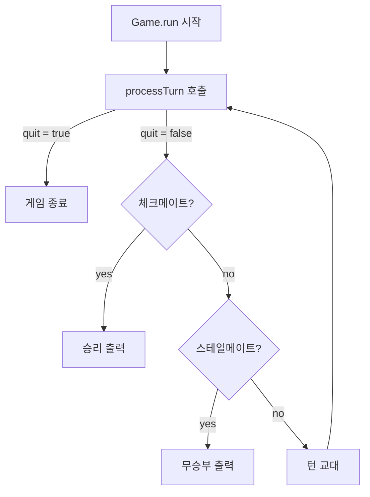
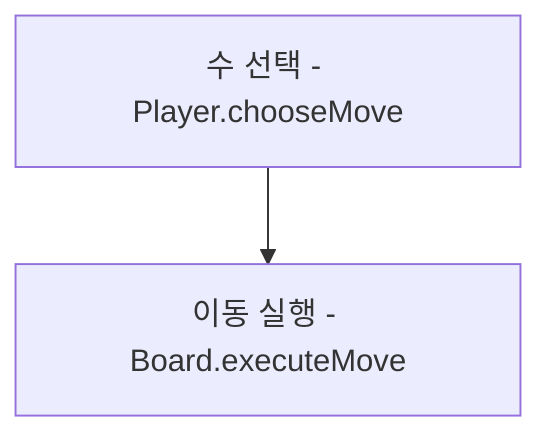
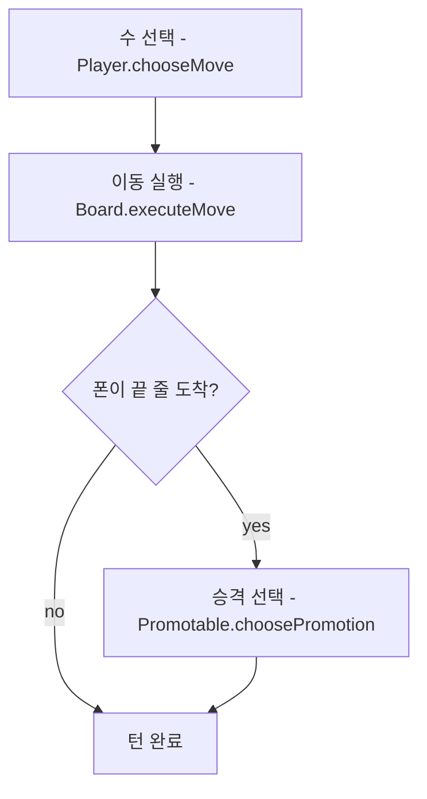
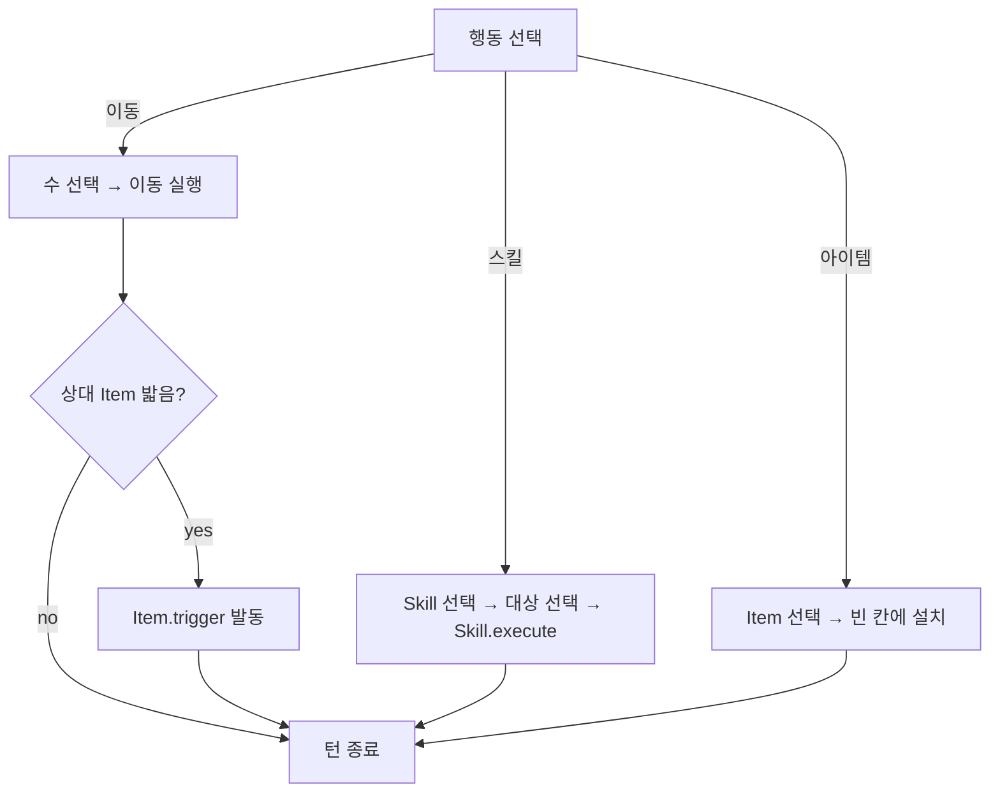
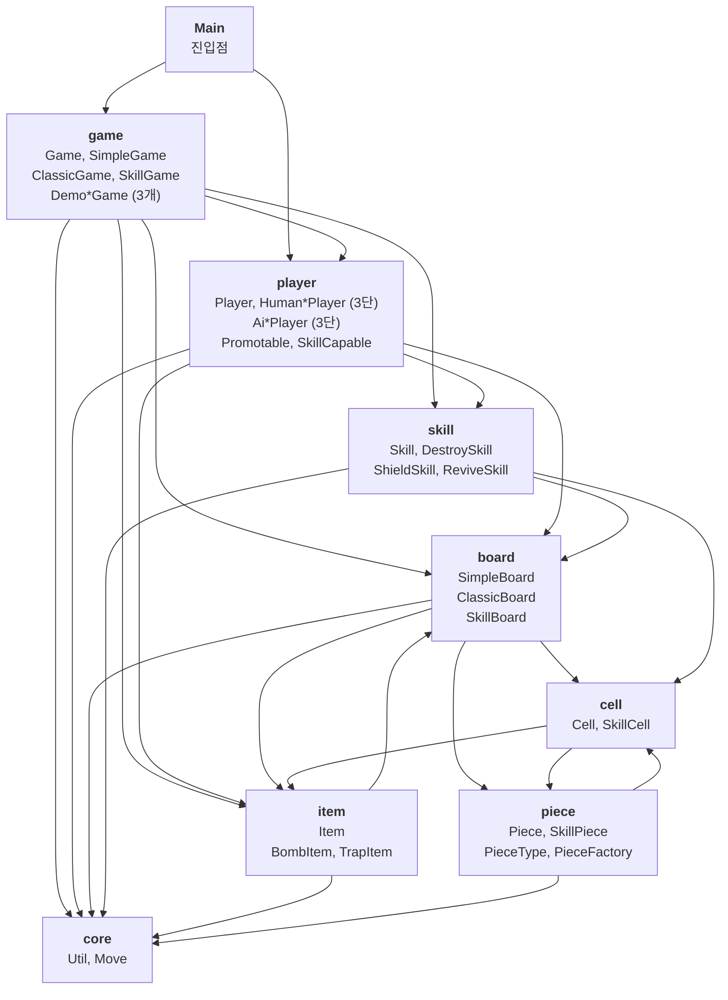

# CLAUDE.md

이 파일은 Claude Code (claude.ai/code)가 이 저장소의 코드를 다룰 때 참고하는 안내 문서입니다.

## 프로젝트 개요

팀노바 기초반 5주차 Java 학습 프로젝트입니다. IntelliJ IDEA를 사용합니다.

## 협업 방식

- **대화 기반 점진적 개발**: 한번에 전체 코드를 작성하지 않음
- **뼈대 먼저**: 프로그램 구조/설계를 먼저 대화로 확정
- **단계별 구현**: 설계 확정 후 기능 하나씩 구현하며 진행
- **매 단계 컨펌**: 각 단계마다 사용자 확인 후 다음 진행
- **커밋 메시지 제공**: 각 구현이 끝나면 커밋 메시지를 제공 (커밋은 사용자가 직접)

## 빌드 및 실행

IntelliJ IDEA의 **Terminal 탭**에서 실행합니다 (Run 콘솔 아님).

```bash
# 컴파일
javac -d out src/*.java

# 실행
java -cp out Main
```

**실행 환경**: 터미널 raw 모드 (`stty -icanon -echo`)
- 화살표 키 입력을 위해 터미널 raw 모드 사용
- 화면 클리어: ANSI 이스케이프 코드 (`\033[H\033[2J`)
- 프로그램 종료 시 자동으로 터미널 복원 (`stty sane`)

## 프로젝트 구조

총 **37개 소스 파일**, 8개 패키지

```
src/
├── Main.java                       진입점 (타이틀, 모드 선택, 게임 시작)
│
├── board/                          체스판 계층 (3개)
│   ├── SimpleBoard.java            기본 체스판 (격자, 이동, 체크)
│   ├── ClassicBoard.java           공식 체스판 (+캐슬링, 앙파상, 프로모션)
│   └── SkillBoard.java             스킬 체스판 (+스킬, 아이템, 방패, 동결)
│
├── cell/                           칸 계층 (2개)
│   ├── Cell.java                   기본 칸 (기물 관리)
│   └── SkillCell.java              스킬 칸 (+아이템 관리)
│
├── core/                           유틸리티 (3개)
│   ├── Chess.java                  체스 전용 상수 (좌표, 프로모션, 액션, 스킬)
│   ├── Move.java                   이동 데이터 (출발/도착 좌표)
│   └── Util.java                   범용 유틸리티 (입력, 화면, 딜레이, 랜덤)
│
├── game/                           게임 루프 계층 (7개)
│   ├── Game.java                   게임 추상 클래스 (템플릿 메서드 패턴)
│   ├── SimpleGame.java             기본 체스 게임
│   ├── ClassicGame.java            공식 체스 게임
│   ├── SkillGame.java              스킬 모드 게임
│   ├── DemoSimpleGame.java         기본 체스 튜토리얼
│   ├── DemoClassicGame.java        공식 체스 튜토리얼
│   └── DemoSkillGame.java          스킬 모드 튜토리얼
│
├── item/                           아이템 계층 (3개)
│   ├── Item.java                   아이템 추상 클래스
│   ├── BombItem.java               폭탄 (기물 제거, 킹 면역)
│   └── TrapItem.java               함정 (기물 동결)
│
├── piece/                          기물 계층 (4개)
│   ├── Piece.java                  기물 클래스 (데이터 기반 이동)
│   ├── PieceType.java              기물 종류 열거형
│   ├── PieceFactory.java           기물 속성 설정 팩토리
│   └── SkillPiece.java             스킬 기물 (+방패, 동결 상태)
│
├── player/                         플레이어 계층 (9개)
│   ├── Player.java                 플레이어 추상 클래스
│   ├── HumanPlayer.java            사람 (기본 - 화살표 키 조작)
│   ├── ClassicHumanPlayer.java     사람 (공식 - +프로모션)
│   ├── SkillHumanPlayer.java       사람 (스킬 - +스킬/아이템)
│   ├── AiPlayer.java               AI (기본 - 우선순위 전략)
│   ├── ClassicAiPlayer.java        AI (공식 - +프로모션)
│   ├── SkillAiPlayer.java          AI (스킬 - +스킬/아이템)
│   ├── Promotable.java             프로모션 인터페이스
│   └── SkillCapable.java           스킬/아이템 인터페이스
│
└── skill/                          스킬 계층 (4개)
    ├── Skill.java                  스킬 추상 클래스
    ├── DestroySkill.java           파괴 (상대 기물 제거)
    ├── ShieldSkill.java            방패 (아군 기물 보호)
    └── ReviveSkill.java            부활 (잡힌 기물 복원)

out/                                컴파일된 클래스 파일 (gitignore)
```

## 개발 프로세스

1. **설계**: 구현 전 구조/로직 설계 및 컨펌
2. **구현**: 점진적으로 코드 작성, 각 단계마다 컨펌
3. **검증**: 조건에 맞는지 테스트 및 확인

## 개발 규칙

- **점진적 커밋**: 모든 커밋은 사용자 컨펌 후 진행 (커밋은 사용자가 직접, 메시지만 제공)
- **주석 필수**: 변수명, 로직 전개, 타입 선택에 대한 근거를 주석으로 작성
- **단계별 진행**: 기능 하나씩 구현 후 확인
- **변수 선언**: 쉼표로 구분하지 말고 각 변수를 개별 라인에 선언
  ```java
  // 나쁜 예
  int a = 1, b = 2, c = 3;

  // 좋은 예
  int a = 1;
  int b = 2;
  int c = 3;
  ```
- **복합 조건은 boolean 변수로 분리**: if 조건에 `&&`/`||`가 2개 이상이면 각 조건을 의미 있는 이름의 boolean 지역변수로 분리
  ```java
  // 나쁜 예: 한 줄에 조건이 너무 많음
  if (piece instanceof Pawn && move.fromCol != move.toCol && grid[move.toRow][move.toCol].isEmpty()) {

  // 좋은 예: 각 조건에 이름을 부여
  boolean isPawn = piece instanceof Pawn;
  boolean movedDiagonally = move.fromCol != move.toCol;
  boolean destEmpty = grid[move.toRow][move.toCol].isEmpty();
  boolean isEnPassant = isPawn && movedDiagonally && destEmpty;

  if (isEnPassant) {
  ```
- **메뉴 번호 변수 관리**: 메뉴 출력 번호와 입력 체크 번호를 변수로 통일 관리하여 불일치 방지
  ```java
  // 나쁜 예: 번호가 따로 하드코딩되어 불일치 가능
  System.out.println("[1] 옵션A");
  System.out.println("[2] 옵션B");
  if (key == 1) { ... }
  if (key == 2) { ... }

  // 좋은 예: 변수로 관리하여 불일치 방지
  final int KEY_A = 1;
  final int KEY_B = 2;
  System.out.println("[" + KEY_A + "] 옵션A");
  System.out.println("[" + KEY_B + "] 옵션B");
  if (key == KEY_A) { ... }
  if (key == KEY_B) { ... }
  ```
- **조건문 선택 기준 (if-else vs switch)**:
  - `if-else`: 복합 조건 (범위 비교, AND/OR 조합, null 체크, 객체 비교)
  - `switch`: 단일 값으로 여러 분기 처리 (메뉴 선택, 열거형 등)
  ```java
  // if-else 사용: 범위/복합 조건
  if (score >= 90) {
      grade = "A";
  } else if (score >= 80) {
      grade = "B";
  }

  // switch 사용: 단일 값 → 여러 분기
  switch (choice) {
      case 1:
          goWholesaler();
          break;
      case 2:
          startBusiness();
          break;
  }
  ```
- **접근한정자 필수**: 모든 필드와 메서드에 적절한 접근한정자를 반드시 명시 (package-private 금지)
  - `private`: 클래스 내부에서만 사용하는 필드/메서드 (기본값으로 사용)
  - `public`: 외부 클래스에서 접근해야 하는 필드/메서드
  - 접근한정자 없이 선언하지 않는다 (Java의 package-private는 의도가 불명확)
  ```java
  // 나쁜 예: 접근한정자 생략 (package-private)
  int money;
  void startBusiness() { ... }

  // 좋은 예: 의도를 명확히
  private int money;
  public void startBusiness() { ... }
  ```
- **주석은 누구나 이해할 수 있게**: 프로그래밍 전문 용어(0-based, 1-based, nullable 등) 대신 누구나 알 수 있는 한국어로 작성
  ```java
  // 나쁜 예: 전문 용어 사용
  /// 번호(1-based)로 상품 찾기
  /// 유효하지 않은 번호면 null 반환

  // 좋은 예: 누구나 이해 가능
  /// 사용자가 입력한 번호(1번부터 시작)로 상품 찾기
  /// 존재하지 않는 번호면 null 반환
  ```
- **`/// <summary>` 주석 필수**: 메서드와 필드 모두 `/// <summary>` 형식으로 설명 작성 (IDE에서 마우스 커서를 올리면 바로 확인 가능)
  ```java
  /// <summary>
  /// 메서드 설명
  /// </summary>
  void someMethod() {
      // ...
  }

  /// <summary>
  /// 필드 설명
  /// </summary>
  private final ArrayList<Move> allMoves = new ArrayList<>();
  ```
- **try-catch 사용 원칙**: 실제 예외가 발생할 수 있는 상황에서만 사용
  - **사용하지 말 것**: 단순 입력 검증 (숫자 파싱 등) → `hasNextInt()` 같은 검증 메서드 활용
  - **불가피한 경우**: Java checked exception (Thread.sleep, System.in 등)
    - 컴파일러 요구사항임을 주석으로 명시
  ```java
  // 나쁜 예: 입력 검증에 try-catch 사용
  try {
      int num = Integer.parseInt(input);
  } catch (NumberFormatException e) {
      num = 0;
  }

  // 좋은 예: 검증 메서드 사용
  if (scanner.hasNextInt()) {
      int num = scanner.nextInt();
  } else {
      scanner.next();  // 잘못된 입력 소비
      int num = 0;
  }

  // 불가피한 경우: checked exception (주석 필수)
  // 주의: Thread.sleep()은 checked exception이라 try-catch 필수 (컴파일러 요구)
  try {
      Thread.sleep(ms);
  } catch (InterruptedException e) {
      // 단일 스레드 앱에서는 발생하지 않음 (컴파일러 요구사항)
  }
  ```
- **Tester-Doer 패턴**: 객체를 가져와서 null 체크하는 대신, 먼저 존재 여부를 확인하고 필요할 때만 가져오기
  ```java
  // 나쁜 예: 가져온 후 null 체크
  Piece piece = cell.getPiece();
  if (piece != null) {
      // piece 사용
  }

  // 좋은 예: 존재 여부 먼저 확인 (Tester), 있을 때만 가져오기 (Doer)
  if (cell.hasPiece()) {
      Piece piece = cell.getPiece();
      // piece 사용
  }

  // 없는 경우를 먼저 걸러내는 것도 동일한 패턴
  if (cell.isEmpty()) {
      return;
  }
  Piece piece = cell.getPiece();
  ```
- **Cell 접근 일관성**: 칸의 상태를 확인할 때는 항상 Cell의 메서드(`isEmpty()`, `hasPiece()`, `getPiece()`)를 사용
  ```java
  // 나쁜 예: Board의 래퍼 메서드로 null 반환에 의존
  Piece piece = board.getPiece(row, col);
  if (piece == null) { ... }

  // 좋은 예: Cell의 상태 확인 메서드를 직접 사용
  if (board.grid[row][col].isEmpty()) { ... }
  Piece piece = board.grid[row][col].getPiece();
  ```
- **null 대신 의미 있는 메서드 사용**: `setter(null)`로 제거하지 말고 전용 remove 메서드 사용
  ```java
  // 나쁜 예: null이 "제거"를 의미하는지 알 수 없음
  cell.setPiece(null);
  cell.setItem(null);

  // 좋은 예: 의도가 명확한 전용 메서드
  cell.removePiece();
  cell.removeItem();
  ```

## 5주차 과제

**목표**: 상속(abstract class, 메서드 오버라이딩, 다형성)을 활용한 프로그램 제작

**과제 내용**: 콘솔 체스 게임
- 기물마다 이동 규칙이 달라 상속을 자연스럽게 활용
- 2인 대전 + AI 대전 모드
- 기본 규칙 먼저 → 특수 규칙 단계적 추가

### 상속 구조 (7개 계층 + 2개 인터페이스)

**1차: Piece 계층 (기물)**

```
Piece (데이터 기반 이동 - PieceFactory가 type별 방향/속성 설정)
 └── SkillPiece  (+방패 shielded, 동결 frozen 상태)
```

- `PieceType` 열거형이 기물 종류(KING, QUEEN, ROOK, BISHOP, KNIGHT, PAWN)를 정의
- `PieceFactory.configure()`가 type에 따라 이름/기호/가치/이동방향을 설정
- 모든 기물이 동일한 `Piece.getValidMoves()` → `calculateMoves()`를 사용
- 기물별 차이는 `directions`(이동+잡기), `moveOnlyDirections`(전진만), `captureOnlyDirections`(잡기만), `repeatMove`(슬라이드 여부) 데이터로 구분

**2차: Board 계층 (체스판)**

```
SimpleBoard (기본 이동, 체크, 체크메이트)
 └── ClassicBoard  (+캐슬링, 앙파상, 프로모션)
      └── SkillBoard (+스킬, 아이템, 방패, 동결)
```

- `SimpleBoard`에 훅 메서드 4개 정의 (하위 클래스가 오버라이드)
  - `addSpecialMoves()` → ClassicBoard가 캐슬링/앙파상 추가
  - `isMovementBlocked()` → SkillBoard가 동결 상태 확인
  - `isCaptureBlocked()` → SkillBoard가 방패 상태 확인
  - `createCell()` / `createPiece()` → SkillBoard가 SkillCell/SkillPiece 생성

**3차: Cell 계층 (칸)**

```
Cell (기물 관리: getPiece/setPiece/removePiece/hasPiece/isEmpty)
 └── SkillCell  (+아이템 관리: getItem/setItem/removeItem/hasItem)
```

**4차: Player 계층 (플레이어)**

사람 체인과 AI 체인이 병렬 구조로 모드별 기능을 단계적으로 추가:

```
              Player (abstract - chooseMove)
             /                              \
    HumanPlayer (화살표 키 조작)          AiPlayer (우선순위 전략)
         |                                    |
ClassicHumanPlayer (+Promotable)       ClassicAiPlayer (+Promotable)
         |                                    |
SkillHumanPlayer (+SkillCapable)       SkillAiPlayer (+SkillCapable)
```

**5차: Game 계층 (게임 루프)**

각 모드의 게임 루프 + 각 모드의 튜토리얼이 서브클래스로 존재:

```
Game (abstract - 템플릿 메서드 패턴)
 └── SimpleGame (기본 이동 + afterMove 훅)
      ├── DemoSimpleGame
      └── ClassicGame (afterMove → 프로모션)
           ├── DemoClassicGame
           └── SkillGame (+스킬, 아이템, run/processTurn 오버라이드)
                └── DemoSkillGame
```

**6차: Skill 계층 (스킬)**

```
Skill (abstract - canUse/findTargets/execute)
 ├── DestroySkill  (상대 기물 1개 제거, 킹 제외)
 ├── ShieldSkill   (아군 기물 1개에 방패, 1턴간 잡기 방어)
 └── ReviveSkill   (잡힌 아군 기물 1개 부활, 빈 칸에 배치)
```

**7차: Item 계층 (아이템)**

```
Item (abstract - trigger/getSymbol)
 ├── BombItem  (밟은 기물 제거, 킹은 면역)
 └── TrapItem  (밟은 기물 동결, 다음 턴 이동 불가)
```

**인터페이스 2개**

```
Promotable   → choosePromotion(board)
               구현: ClassicHumanPlayer, ClassicAiPlayer

SkillCapable → chooseAction(), chooseSkill(), chooseSkillTarget(),
               chooseItemType(), chooseItemTarget(), chooseReviveTarget()
               구현: SkillHumanPlayer, SkillAiPlayer
```

### 클래스 구조 (37개)

**진입점**

| 클래스 | 역할 |
|--------|------|
| `Main` | 타이틀 화면, 모드 선택 (기본/공식/스킬 × 2인/AI + 튜토리얼), 게임 시작 |

**core 패키지 - 유틸리티**

| 클래스 | 역할 |
|--------|------|
| `Chess` | 체스 전용 상수 (보드 크기, 좌표, 프로모션, 액션, 스킬), 좌표 변환 |
| `Move` | 이동 데이터 (출발/도착 행열 좌표, set()으로 재사용) |
| `Util` | 범용 유틸리티 - 상수 (키, 색상), 터미널 raw 모드, 입력, 화면, 딜레이, 랜덤 |

**piece 패키지 - 기물**

| 클래스 | 역할 |
|--------|------|
| `Piece` | 기물 클래스 - `getValidMoves()` → `calculateMoves()`로 데이터 기반 이동 |
| `SkillPiece` | Piece + `shielded`/`frozen` 필드 (스킬 효과 상태) |
| `PieceType` | 열거형 (KING, QUEEN, ROOK, BISHOP, KNIGHT, PAWN) |
| `PieceFactory` | 정적 `configure()` - type에 따라 이름/기호/가치/방향 설정 |

**cell 패키지 - 칸**

| 클래스 | 역할 |
|--------|------|
| `Cell` | 기본 칸 - 기물 관리 (`getPiece`, `setPiece`, `removePiece`, `hasPiece`, `isEmpty`) |
| `SkillCell` | Cell + 아이템 관리 (`getItem`, `setItem`, `removeItem`, `hasItem`) |

**board 패키지 - 체스판**

| 클래스 | 역할 |
|--------|------|
| `SimpleBoard` | 8x8 격자, 기물 배치, 기본 이동, 체크/체크메이트 판정, 훅 메서드 4개 |
| `ClassicBoard` | SimpleBoard + 캐슬링, 앙파상, 프로모션 (`addSpecialMoves` 오버라이드) |
| `SkillBoard` | ClassicBoard + 아이템/스킬 효과, 방패/동결 관리, 기물 제거/부활 |

**player 패키지 - 플레이어**

| 클래스/인터페이스 | 역할 |
|-------------------|------|
| `Player` | **추상** - `chooseMove()` 선언, 색상/이름 보유 |
| `HumanPlayer` | 화살표 키로 커서 이동 → Enter로 기물 선택/도착지 확정 |
| `ClassicHumanPlayer` | HumanPlayer + `Promotable` (프로모션 시 숫자 키로 기물 선택) |
| `SkillHumanPlayer` | ClassicHumanPlayer + `SkillCapable` (행동/스킬/아이템/부활 선택) |
| `AiPlayer` | 쉬움(랜덤) / 보통(체크메이트 > 잡기 > 체크 > 랜덤) |
| `ClassicAiPlayer` | AiPlayer + `Promotable` (항상 퀸으로 승격) |
| `SkillAiPlayer` | ClassicAiPlayer + `SkillCapable` (확률 기반 행동 선택) |
| `Promotable` | **인터페이스** - `choosePromotion()` |
| `SkillCapable` | **인터페이스** - 스킬/아이템 선택 메서드 6개 |

**game 패키지 - 게임 루프**

| 클래스 | 역할 |
|--------|------|
| `Game` | **추상** - 템플릿 메서드 패턴 (`run` → `processTurn` → 체크메이트 → `switchTurn`) |
| `SimpleGame` | `processTurn`: chooseMove → executeMove → afterMove 훅 |
| `ClassicGame` | SimpleGame + `afterMove` 오버라이드 (프로모션 확인) |
| `SkillGame` | ClassicGame + `processTurn`/`run` 오버라이드 (효과 정리 → 행동 선택 → 아이템 트리거) |
| `DemoSimpleGame` | SimpleGame + 15턴 스크립트 (나이트→비숍→룩→퀸→폰→킹→체크→체크메이트) |
| `DemoClassicGame` | ClassicGame + 5턴 스크립트 (캐슬링→앙파상→프로모션) |
| `DemoSkillGame` | SkillGame + 8턴 스크립트 (파괴→방패→함정→폭탄→동결체험→부활) |

**skill 패키지 - 스킬**

| 클래스 | 역할 |
|--------|------|
| `Skill` | **추상** - `canUse`/`findTargets`/`execute`, 사용 횟수 관리 |
| `DestroySkill` | 상대 기물 1개 제거 (킹 제외), 2회 사용 |
| `ShieldSkill` | 아군 기물 1개에 방패 (1턴간 잡기 방어), 2회 사용 |
| `ReviveSkill` | 잡힌 아군 기물 1개 부활 (빈 칸에 배치), 1회 사용 |

**item 패키지 - 아이템**

| 클래스 | 역할 |
|--------|------|
| `Item` | **추상** - `trigger`/`getSymbol`, 설치 위치/소유자 보유 |
| `BombItem` | 밟은 기물 제거 (킹은 면역), 2회 설치 |
| `TrapItem` | 밟은 기물 동결 (다음 턴 이동 불가), 2회 설치 |

### 게임 루프 흐름

**공통 루프 (`Game.run`)** - 템플릿 메서드 패턴

모든 게임 모드가 동일한 루프 구조를 공유하고, `processTurn()`과 `createBoard()`만 오버라이드.
SkillGame은 `run()` 자체도 오버라이드하여 동결 해제 단계를 추가.



**SimpleGame.processTurn** - 기본 체스 (이동만)



**ClassicGame.processTurn** - 공식 체스 (이동 + 프로모션)



**SkillGame.processTurn** - 스킬 모드 (이동/스킬/아이템)



### 모듈 상호작용

**패키지 간 의존관계**

화살표 방향 = import 방향 (사용하는 쪽 → 사용되는 쪽)



**주요 상호작용 흐름**

```
1. Main → Game.run() 호출
2. Game → Player.chooseMove() 호출 (다형성)
3. Player → Board.getFilteredMoves() 등으로 합법적인 수 조회
4. Board → Piece.getValidMoves()로 기물별 이동 계산
5. Board → Cell.getPiece()/setPiece()로 격자 상태 변경
6. SkillGame → Skill.execute(), Item.trigger()로 특수 효과 적용
7. SkillBoard → SkillPiece.frozen/shielded로 상태 확인
8. SkillBoard → SkillCell.getItem()/setItem()으로 아이템 관리
```

### 설계 패턴

| 패턴 | 적용 위치 | 설명 |
|------|----------|------|
| **템플릿 메서드** | `Game.run()` → `processTurn()` | 공통 루프를 정의하고 턴 처리만 하위 클래스가 오버라이드 |
| **훅 메서드** | `SimpleBoard` 4개, `SimpleGame` 1개 | Board: `addSpecialMoves`, `isMovementBlocked`, `isCaptureBlocked`, `createCell`/`createPiece`; Game: `afterMove` |
| **팩토리 메서드** | `createBoard()`, `createCell()`, `createPiece()` | 하위 클래스가 자기 모드에 맞는 객체 생성 |
| **정적 팩토리** | `PieceFactory.configure()` | PieceType에 따라 기물 속성(방향, 기호, 가치) 일괄 설정 |
| **다형성** | `Player.chooseMove()` | Game이 Human/AI 구분 없이 동일하게 호출 |
| **인터페이스 분리** | `Promotable`, `SkillCapable` | 모드별 필요한 기능만 인터페이스로 분리, 필요한 클래스만 구현 |

### 좌표 체계

- 내부: `row 0` = 8번 줄(흑), `row 7` = 1번 줄(백), `col 0` = a열
- 변환: `"e2"` → `row=6, col=4` / `row=6, col=4` → `"e2"`

### AI 전략

1. 체크메이트 가능한 수 → 즉시 선택
2. 상대 기물 잡기 (퀸9 > 룩5 > 비숍3 = 나이트3 > 폰1)
3. 체크를 거는 수
4. 랜덤 선택

### 구현 순서

1. **Phase 1**: 기초 뼈대 (Main, Util, Move)
2. **Phase 2**: 기물 상속 계층 (Piece + 6개 하위 클래스)
3. **Phase 3**: 체스판 (SimpleBoard)
4. **Phase 4**: 플레이어 + 게임 루프 (Player, HumanPlayer, Game)
5. **Phase 5**: AI 플레이어 (AiPlayer)
6. **Phase 6**: 특수 규칙 (프로모션 → 캐슬링 → 앙파상 → 스테일메이트)
7. **Phase 7**: 마무리 (하이라이트, 잡은 기물, AI 딜레이)

### UI

**기물 표기**: 이니셜 사용 (체스 표준 표기법)
- K(King), Q(Queen), R(Rook), B(Bishop), N(Knight), P(Pawn)
- 대문자 = 빨간팀, 소문자 = 파란팀

**색상**: ANSI 이스케이프 코드로 콘솔 색상 적용
- 빨간팀: `\033[31m` (RED)
- 파란팀: `\033[34m` (BLUE)
- 초기화: `\033[0m` (RESET)

**체스판**:

```
     a   b   c   d   e   f   g   h
   +---+---+---+---+---+---+---+---+
 8 | r | n | b | q | k | b | n | r | 8    ← 파란팀 (소문자, 파란색)
   +---+---+---+---+---+---+---+---+
 7 | p | p | p | p | p | p | p | p | 7
   +---+---+---+---+---+---+---+---+
 6 |   |   |   |   |   |   |   |   | 6
   +---+---+---+---+---+---+---+---+
 5 |   |   |   |   |   |   |   |   | 5
   +---+---+---+---+---+---+---+---+
 4 |   |   |   |   |   |   |   |   | 4
   +---+---+---+---+---+---+---+---+
 3 |   |   |   |   |   |   |   |   | 3
   +---+---+---+---+---+---+---+---+
 2 | P | P | P | P | P | P | P | P | 2
   +---+---+---+---+---+---+---+---+
 1 | R | N | B | Q | K | B | N | R | 1    ← 빨간팀 (대문자, 빨간색)
   +---+---+---+---+---+---+---+---+
     a   b   c   d   e   f   g   h
```

- 이동 가능한 칸: `·` 표시
- 선택된 기물: `[K]` 형태로 표시

**조작 방식**: 터미널 (화살표 키)
- 화살표 키 → 커서 즉시 이동 (Enter 불필요)
- Enter → 기물 선택 / 이동 확정
- `q` → 취소 / 뒤로가기
- ANSI 이스케이프 코드로 화면 즉시 갱신
