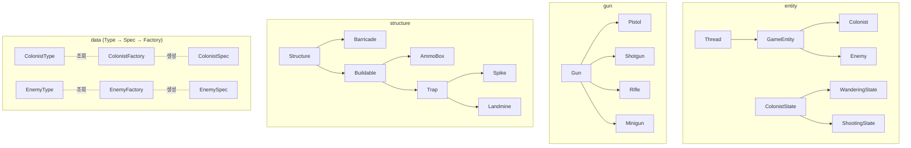
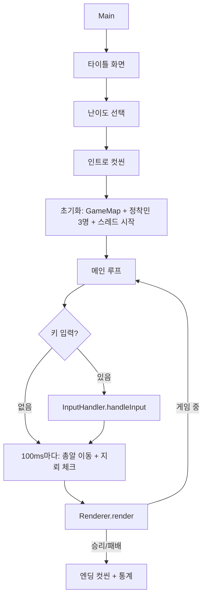
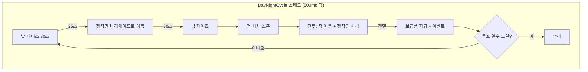
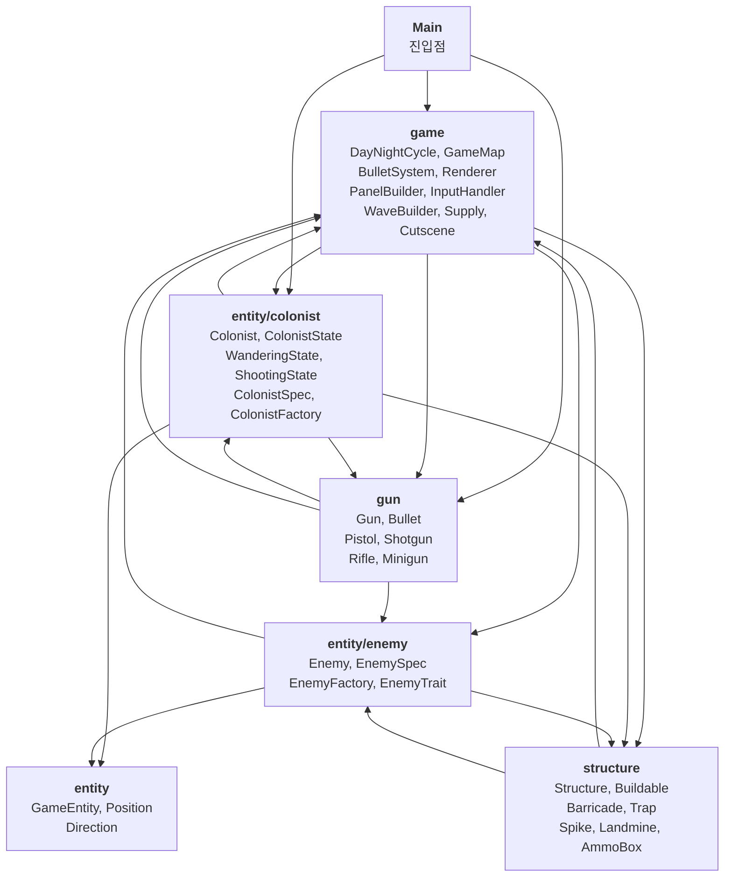

# CLAUDE.md

이 파일은 Claude Code (claude.ai/code)가 이 저장소의 코드를 다룰 때 참고하는 안내 문서입니다.

## 프로젝트 개요

팀노바 기초반 6주차 Java 학습 프로젝트입니다. IntelliJ IDEA를 사용합니다.

**게임**: "표류자들 - The Castaways" (타워 디펜스 서바이벌)
- 3명의 정착민이 바리케이드를 사이에 두고 적 웨이브를 방어
- 낮: 자원 관리 (수리, 치료, 무기 구매, 건설, 모집)
- 밤: 적 웨이브 전투 (자동 사격)
- 승리 조건: 난이도별 목표 일수 생존 (쉬움 7일 / 보통 10일 / 어려움 15일)

**맵 구조**: 100×20 문자
- 왼쪽 (0~14열): 안전지대 (정착민 배회, 탄약 상자)
- 바리케이드 (15~16열): 방벽
- 오른쪽 (17~99열): 전장 (적, 가시덫, 지뢰)

### 상속 구조

**entity 패키지 (생명체)**

GameEntity가 Thread를 상속하여 각 정착민/적이 독립 스레드로 동작.
ColonistState는 상태 패턴으로 낮(배회) ↔ 밤(사격) 행동 전환.

```
GameEntity (abstract, extends Thread — HP, 위치, 스레드 관리)
├── Colonist (무기, 상태 패턴, 사망 애니메이션)
└── Enemy (특성 적용, 바리케이드/정착민 공격, 스파이크 충돌)
```

```
ColonistState (abstract — enter/update/exit)
├── WanderingState (낮: 자동회복, 안전지대 랜덤 이동)
└── ShootingState (밤: 바리케이드 이동 후 사격)
```

**데이터 계층 (Type → Spec → Factory)**

열거형은 순수 타입 식별자, 데이터는 Spec, 생성은 Factory가 담당.

```
ColonistType (GUNNER, SNIPER, ASSAULT)
ColonistSpec (이름, 체력, 발사배율, 치명타, 넉백, 블록 템플릿)
ColonistFactory (Type → Spec 매핑)

EnemyType (WOLF, SPIDER, SKELETON, ZOMBIE, RAT, SLIME, BEAR, BANDIT, SCORPION, ORC, DRAGON, GOLEM)
EnemySpec (이름, 체력, 데미지, 이동속도, 보상, 특성, 블록)
EnemyFactory (Type → Spec 매핑)

EnemyTrait (STANDARD, CHARGER, ARMORED, REGENERATING)
```

**gun 패키지 (무기)**

Gun이 공통 속성을 생성자로 받고, fire()만 서브클래스에서 구현.
fireBullet()이 공통 발사 로직 (조준, 크리티컬, 넉백, 총알 생성).

```
Gun (abstract — name, cost, fireInterval, damage, bulletSpeed, bulletChar, bulletColor)
├── Pistol   (단발, 비용 0, 기본 무기)
├── Shotgun  (부채꼴 3발 ±2행, 비용 25)
├── Rifle    (관통 단발, 비용 20)
└── Minigun  (매 틱 단발, 비용 30)

Bullet (데이터 클래스 — 시작/목표 좌표, 데미지, 관통, 넉백)
```

**structure 패키지 (구조물)**

Structure가 위치/내구도, Buildable이 비용, Trap이 피해량 계층.

```
Structure (column, maxHp — 내구도 관리)
├── Barricade (레벨업, 무적 모드, 피격/수리 깜빡임)
└── Buildable (cost — 건설 가능 구조물)
    ├── AmmoBox (발사속도 30% 증가)
    └── Trap (damage — 피해를 주는 구조물)
        ├── Spike (내구도 10, 적이 지나가면 3 데미지)
        └── Landmine (일회용, 반경 3칸 15 데미지 폭발)
```

**game 패키지 (게임 시스템)**

```
Main (진입점 — 난이도 선택, 초기화, 메인 루프)
DayNightCycle (Thread — 낮/밤 전환, 적 스폰, 이벤트)
WaveBuilder (일차별 적 웨이브 구성)
GameMap (게임 상태 컨테이너 — 모든 엔티티/구조물 관리)
BulletSystem (총알 이동 + 충돌 처리)
Renderer (화면 렌더링 — 버퍼 기반)
PanelBuilder (오른쪽 정보 패널 생성)
InputHandler (키 입력 읽기 + 명령 디스패치)
Supply (보급품 자원 관리)
Cutscene (스토리 애니메이션)
HitEffect (명중 이펙트 데이터)
LogEntry (로그 메시지 데이터)
Util (터미널 모드, 화면 클리어, 딜레이, 랜덤)
DifficultySettings (난이도별 배율)
Difficulty (EASY, NORMAL, HARD)
DayEvent (SUPPLY_DROP, WANDERER, STORM_WARNING, CALM_DAY)
Direction (8방향 이동 벡터)
Position (행/열 좌표)
```

### 상속 구조 차트



### 스레드 모델

| 스레드 | 클래스 | 틱 간격 | 역할 |
|--------|--------|---------|------|
| Main | Main | 16ms (입력) / 100ms (물리) | 입력 폴링, 총알 이동, 지뢰 체크, 렌더링 |
| DayNightCycle | DayNightCycle | 500ms | 낮↔밤 전환, 적 스폰, 이벤트 발생 |
| Colonist ×N | Colonist | 500ms | 배회/자동회복 (낮), 이동/사격 (밤) |
| Enemy ×N | Enemy | 200~700ms (종류별) | 이동, 공격, 특성 적용 |

### 게임 루프 흐름





### 패키지 간 의존관계



### 게임 메카닉

**정착민 패시브**

| 유형 | 패시브 | 효과 |
|------|--------|------|
| 사격수 (GUNNER) | 속사 | 발사 간격 20% 감소 |
| 저격수 (SNIPER) | 치명타 | 30% 확률로 데미지 2배 |
| 돌격수 (ASSAULT) | 넉백 | 명중 시 적 1칸 밀어냄 |

**무기**

| 무기 | 비용 | 간격 | 데미지 | 속도 | 패턴 |
|------|------|------|--------|------|------|
| 피스톨 | 0 | 4틱 | 5 | 3 | 단발 |
| 샷건 | 25 | 6틱 | 3 | 3 | 부채꼴 3발 (±2행) |
| 라이플 | 20 | 5틱 | 8 | 6 | 관통 단발 |
| 미니건 | 30 | 1틱 | 2 | 4 | 매 틱 단발 |

**적 특성**

| 특성 | 효과 |
|------|------|
| STANDARD | 기본 이동 |
| CHARGER | 바리케이드 8칸 이내에서 2칸 이동 |
| ARMORED | 받는 데미지 ÷2 |
| REGENERATING | 3틱마다 +1 HP |

**구조물**

| 구조물 | 비용 | 효과 |
|--------|------|------|
| 가시덫 | 20 | 내구도 10, 적 통과 시 3 데미지 |
| 지뢰 | 25 | 일회용, 반경 3칸 15 데미지 |
| 탄약 상자 | 20 | 전체 발사속도 30% 증가 |
| 바리케이드 강화 | 15/25 | Lv1→2→3, HP 100→150→200 |

**난이도**

| 난이도 | 적 수 | 보급량 | 승리 일수 |
|--------|-------|--------|-----------|
| 쉬움 | 0.7배 | 1.5배 | 7일 |
| 보통 | 1.0배 | 1.0배 | 10일 |
| 어려움 | 1.3배 | 0.7배 | 15일 |

**낮 이벤트** (2일차부터 랜덤 발생)

| 이벤트 | 효과 |
|--------|------|
| 보급품 발견 | +15 보급품 |
| 떠돌이 합류 | 랜덤 정착민 +30 HP |
| 폭풍 경고 | 다음 밤 일반 몬스터 50% 증가 |
| 평온한 하루 | 효과 없음 |

### UI

**화면 구성**: 왼쪽 100칸 게임 맵 + 오른쪽 정보 패널

**조작**: 터미널 raw 모드 (화살표 키 즉시 입력)
- ↑↓: 정착민 선택
- 1~5: 수리/무기/치료/건설/모집
- n: 밤으로 건너뛰기
- 0: 치트 모드
- q: 종료/취소

**색상**: ANSI 이스케이프 코드
- 바리케이드: 피격 시 빨강, 수리 시 초록
- 적: HP 비율에 따라 위에서부터 빨간색 채움
- 정착민: 사망 시 회색 → 페이드 아웃 (800ms)
- 총알/이펙트: 무기별 색상

## 협업 방식

- **대화 기반 점진적 개발**: 한번에 전체 코드를 작성하지 않음
- **뼈대 먼저**: 프로그램 구조/설계를 먼저 대화로 확정
- **단계별 구현**: 설계 확정 후 기능 하나씩 구현하며 진행
- **매 단계 컨펌**: 각 단계마다 사용자 확인 후 다음 진행
- **커밋 메시지 제공**: 각 구현이 끝나면 커밋 메시지를 제공 (커밋은 사용자가 직접)
- **최소 커밋 단위**: 구현을 최대한 작게 나누어 최소한의 커밋 단위로 진행. 하나의 커밋에 여러 기능을 섞지 않는다
- **테스트 명령어 제공**: 구현 완료 시 항상 컴파일+실행 명령어를 함께 제공

## 빌드 및 실행

IntelliJ IDEA의 **Terminal 탭**에서 실행합니다 (Run 콘솔 아님).

```bash
# 컴파일
javac -d out $(find src -name "*.java")

# 실행
java -cp out Main
```

**실행 환경**: 터미널 raw 모드 (`stty -icanon -echo`)
- 화살표 키 입력을 위해 터미널 raw 모드 사용
- 화면 클리어: ANSI 이스케이프 코드 (`\033[H\033[2J`)
- 프로그램 종료 시 자동으로 터미널 복원 (`stty sane`)

## 개발 프로세스

1. **설계**: 구현 전 구조/로직 설계 및 컨펌
2. **구현**: 점진적으로 코드 작성, 각 단계마다 컨펌
3. **검증**: 조건에 맞는지 테스트 및 확인

## 용어 및 설계 결정

- **Supply**: 식민지 전체의 자원/물품 보유량을 관리하는 클래스 (인벤토리 대신 사용)
- **저장소**: 건물 이름. 건설하면 Supply 용량 증가 + 추가 물품 보관 가능

## 개발 규칙

- **점진적 커밋**: 모든 커밋은 사용자 컨펌 후 진행 (커밋은 사용자가 직접, 메시지만 제공)
- **상수는 해당 클래스에**: 상수 전용 클래스(Config 등)를 만들지 않고, 각 상수를 해당 개념을 소유하는 클래스에 둔다
  ```java
  // 나쁜 예: 중앙 집중 상수 클래스
  public class Config {
      public static final int MAP_WIDTH = 60;
      public static final int COLONIST_MAX_HP = 100;
  }

  // 좋은 예: 각 클래스가 자기 상수를 소유
  public class GameMap {
      public static final int WIDTH = 60;
  }
  public class Colonist {
      private static final int MAX_HP = 100;
  }
  ```
- **static 사용 기준**: 상수는 `static final`, 그 외에는 지양
  - `static final` 상수: **OK** — 고정값은 인스턴스마다 중복 저장할 필요 없음 (public/private 모두)
  - `final` 인스턴스 필드: 생성자에서 인스턴스마다 다른 값을 받는 경우에만 사용
  - 가변 `static` 필드: **금지** — 해당 데이터를 관리하는 객체의 인스턴스 필드로 이동
  - `static` 메서드: 유틸리티 헬퍼(Util)나 팩토리 메서드(Cutscene.intro())에만 사용. 그 외에는 인스턴스 메서드 사용
  ```java
  // 좋은 예: 외부에서 접근하는 고정값
  public static final int WIDTH = 100;

  // 좋은 예: 내부 고정값 (인스턴스마다 중복 저장 방지)
  private static final int SHOOT_COL = 12;

  // 좋은 예: 인스턴스마다 다른 값 (생성자에서 받음)
  private final String name;

  // 나쁜 예: 고정값인데 인스턴스 필드 (메모리 낭비)
  private final int SHOOT_COL = 12;

  // 나쁜 예: 가변 static 필드
  private static int count = 0;
  ```
- **열거형은 순수 타입 식별자**: 열거형(enum)에 데이터와 메서드를 넣지 않는다. 데이터는 별도의 Spec 데이터 클래스에, 조회는 Factory 클래스에서 담당
  ```java
  // 나쁜 예: 열거형이 데이터까지 보유
  public enum EnemyType {
      WOLF("늑대", 30, 3, 400, ...);
      private final String name;
      public String getName() { return name; }
  }

  // 좋은 예: 열거형은 타입만, 데이터는 분리
  public enum EnemyType { WOLF, SPIDER, ... }
  public class EnemySpec { /* 데이터 필드 */ }
  public class EnemyFactory { /* Type → Spec 매핑 */ }
  ```
- **주석은 현재 모듈만 설명**: 주석은 "이 코드가 무엇을 하는지"만 담백하게 기술. 설계 경위(왜 이렇게 바꿨는지), 패턴 이름(조합 패턴, 팩토리 패턴 등), 리팩토링 히스토리는 주석에 남기지 않는다
- **주석 필수**: 변수명, 로직 전개, 타입 선택에 대한 근거를 주석으로 작성
- **단계별 진행**: 기능 하나씩 구현 후 확인
- **변수 선언**: 쉼표로 구분하지 말고 각 변수를 개별 라인에 선언
  ```java
  // 나쁜 예
  int a = 1, b = 2, c = 3;

  // 좋은 예
  int a = 1;
  int b = 2;
  int c = 3;
  ```
- **복합 조건은 boolean 변수로 분리**: if 조건에 `&&`/`||`가 2개 이상이면 각 조건을 의미 있는 이름의 boolean 지역변수로 분리
  ```java
  // 나쁜 예: 한 줄에 조건이 너무 많음
  if (piece instanceof Pawn && move.fromCol != move.toCol && grid[move.toRow][move.toCol].isEmpty()) {

  // 좋은 예: 각 조건에 이름을 부여
  boolean isPawn = piece instanceof Pawn;
  boolean movedDiagonally = move.fromCol != move.toCol;
  boolean destEmpty = grid[move.toRow][move.toCol].isEmpty();
  boolean isEnPassant = isPawn && movedDiagonally && destEmpty;

  if (isEnPassant) {
  ```
- **메뉴 번호 변수 관리**: 메뉴 출력 번호와 입력 체크 번호를 변수로 통일 관리하여 불일치 방지
  ```java
  // 나쁜 예: 번호가 따로 하드코딩되어 불일치 가능
  System.out.println("[1] 옵션A");
  System.out.println("[2] 옵션B");
  if (key == 1) { ... }
  if (key == 2) { ... }

  // 좋은 예: 변수로 관리하여 불일치 방지
  final int KEY_A = 1;
  final int KEY_B = 2;
  System.out.println("[" + KEY_A + "] 옵션A");
  System.out.println("[" + KEY_B + "] 옵션B");
  if (key == KEY_A) { ... }
  if (key == KEY_B) { ... }
  ```
- **조건문 선택 기준 (if-else vs switch)**:
  - `if-else`: 복합 조건 (범위 비교, AND/OR 조합, null 체크, 객체 비교)
  - `switch`: 단일 값으로 여러 분기 처리 (메뉴 선택, 열거형 등)
  ```java
  // if-else 사용: 범위/복합 조건
  if (score >= 90) {
      grade = "A";
  } else if (score >= 80) {
      grade = "B";
  }

  // switch 사용: 단일 값 → 여러 분기
  switch (choice) {
      case 1:
          goWholesaler();
          break;
      case 2:
          startBusiness();
          break;
  }
  ```
- **접근한정자 필수**: 모든 필드와 메서드에 적절한 접근한정자를 반드시 명시 (package-private 금지)
  - `private`: 클래스 내부에서만 사용하는 필드/메서드 (기본값으로 사용)
  - `public`: 외부 클래스에서 접근해야 하는 필드/메서드
  - 접근한정자 없이 선언하지 않는다 (Java의 package-private는 의도가 불명확)
  ```java
  // 나쁜 예: 접근한정자 생략 (package-private)
  int money;
  void startBusiness() { ... }

  // 좋은 예: 의도를 명확히
  private int money;
  public void startBusiness() { ... }
  ```
- **주석은 누구나 이해할 수 있게**: 프로그래밍 전문 용어(0-based, 1-based, nullable 등) 대신 누구나 알 수 있는 한국어로 작성
  ```java
  // 나쁜 예: 전문 용어 사용
  /// 번호(1-based)로 상품 찾기
  /// 유효하지 않은 번호면 null 반환

  // 좋은 예: 누구나 이해 가능
  /// 사용자가 입력한 번호(1번부터 시작)로 상품 찾기
  /// 존재하지 않는 번호면 null 반환
  ```
- **`/// <summary>` 주석 필수**: 메서드와 필드 모두 `/// <summary>` 형식으로 설명 작성 (IDE에서 마우스 커서를 올리면 바로 확인 가능)
  ```java
  /// <summary>
  /// 메서드 설명
  /// </summary>
  void someMethod() {
      // ...
  }

  /// <summary>
  /// 필드 설명
  /// </summary>
  private final ArrayList<Move> allMoves = new ArrayList<>();
  ```
- **try-catch 사용 원칙**: 실제 예외가 발생할 수 있는 상황에서만 사용
  - **사용하지 말 것**: 단순 입력 검증 (숫자 파싱 등) → `hasNextInt()` 같은 검증 메서드 활용
  - **불가피한 경우**: Java checked exception (Thread.sleep, System.in 등)
    - 컴파일러 요구사항임을 주석으로 명시
  ```java
  // 나쁜 예: 입력 검증에 try-catch 사용
  try {
      int num = Integer.parseInt(input);
  } catch (NumberFormatException e) {
      num = 0;
  }

  // 좋은 예: 검증 메서드 사용
  if (scanner.hasNextInt()) {
      int num = scanner.nextInt();
  } else {
      scanner.next();  // 잘못된 입력 소비
      int num = 0;
  }

  // 불가피한 경우: checked exception (주석 필수)
  // 주의: Thread.sleep()은 checked exception이라 try-catch 필수 (컴파일러 요구)
  try {
      Thread.sleep(ms);
  } catch (InterruptedException e) {
      // 단일 스레드 앱에서는 발생하지 않음 (컴파일러 요구사항)
  }
  ```
- **Tester-Doer 패턴**: 객체를 가져와서 null 체크하는 대신, 먼저 존재 여부를 확인하고 필요할 때만 가져오기
  ```java
  // 나쁜 예: 가져온 후 null 체크
  Piece piece = cell.getPiece();
  if (piece != null) {
      // piece 사용
  }

  // 좋은 예: 존재 여부 먼저 확인 (Tester), 있을 때만 가져오기 (Doer)
  if (cell.hasPiece()) {
      Piece piece = cell.getPiece();
      // piece 사용
  }

  // 없는 경우를 먼저 걸러내는 것도 동일한 패턴
  if (cell.isEmpty()) {
      return;
  }
  Piece piece = cell.getPiece();
  ```
- **null 대신 의미 있는 메서드 사용**: `setter(null)`로 제거하지 말고 전용 remove 메서드 사용
  ```java
  // 나쁜 예: null이 "제거"를 의미하는지 알 수 없음
  cell.setPiece(null);
  cell.setItem(null);

  // 좋은 예: 의도가 명확한 전용 메서드
  cell.removePiece();
  cell.removeItem();
  ```
- **고정값은 부모 생성자 파라미터로 전달**: 서브클래스마다 같은 고정값을 상수로 두고 setter나 abstract 메서드로 부모에 전달하지 않는다. 부모 생성자 파라미터로 직접 넘기고, 진짜 다른 동작만 abstract로 남긴다
  ```java
  // 나쁜 예: 서브클래스가 상수를 들고 setter로 전달
  public abstract class Structure {
      protected Structure(int column) { this.column = column; }
      protected void setMaxHp(int maxHp) { this.maxHp = maxHp; }
  }
  public class Spike extends Structure {
      private static final int MAX_HP = 10;
      public Spike(int column) {
          super(column);
          setMaxHp(MAX_HP);
      }
  }

  // 좋은 예: 부모 생성자에서 한번에 설정
  public abstract class Structure {
      protected Structure(int column, int maxHp) {
          this.column = column;
          this.maxHp = maxHp;
      }
  }
  public class Spike extends Structure {
      public Spike(int column) {
          super(column, 10);
      }
  }
  ```
- **반복 호출되는 메서드에서 컬렉션/배열 재생성 금지**: 매 프레임·매 틱 호출되는 메서드에서 `new ArrayList`, `new int[]` 등을 매번 생성하지 않는다. 클래스 필드로 선언하고 `clear()` / `Arrays.fill()`로 재사용
  ```java
  // 나쁜 예: 매 프레임마다 새 리스트 생성
  private ArrayList<String> buildPanel() {
      ArrayList<String> lines = new ArrayList<>();
      lines.add("...");
      return lines;
  }

  // 좋은 예: 필드로 재사용
  private final ArrayList<String> panelLines = new ArrayList<>();
  private void buildPanel() {
      panelLines.clear();
      panelLines.add("...");
  }
  ```
